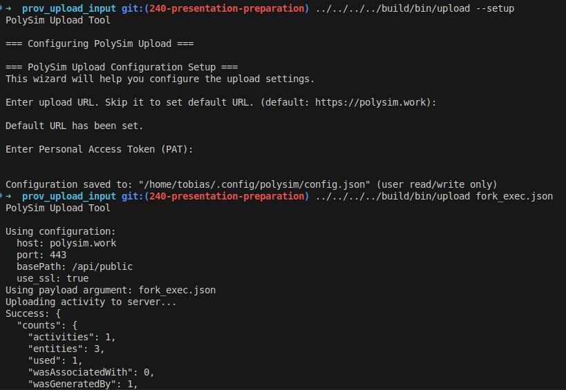
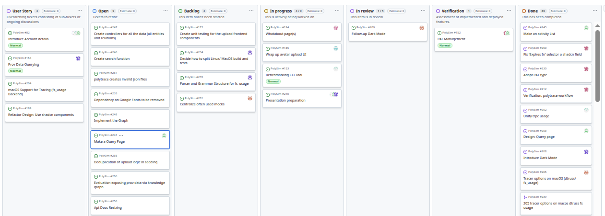
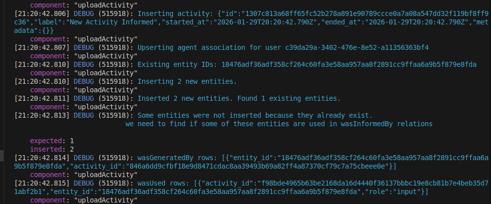
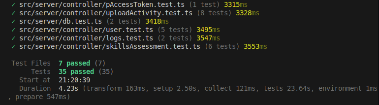
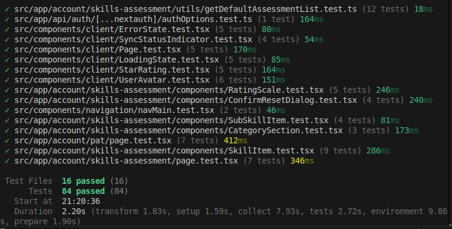
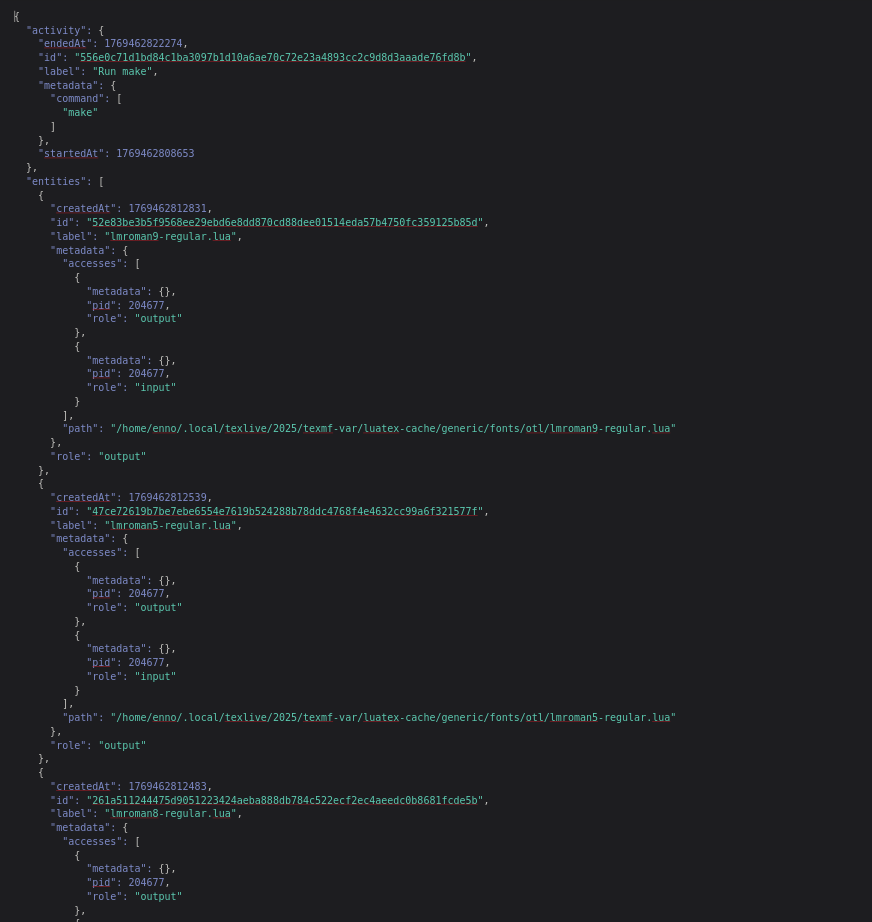

 # Softwareengineering for Physicists
 
---

## Pictures we can use

---



---



---



---



---



---

## Idea

Working on a **realistic-ish** project

Encounter irreducible **complexity**

---

 ## PolySim 

  Provenance tracking for scientific simulations
  
---

# Course idea - two parts


build something useful - learn how to organize

---

FAIR Principles + Provenance @alfiyabegum111-bot - 
Basically the motivation for the project. A real issue in scientific computing.

   Content:
      - Introduction to FAIR principles
      - Importance of data provenance in scientific simulations
      - Tracking data provenance in simulations
      - Benefits of FAIR and provenance for researchers

Here we can make the point why centralized storage and management of provenance data is important
 
 -> web platform

---

# overview

---

Modern software engineering practices

 - Version Control with Git and GitHub
 - Agile Methodologies (Scrum/Kanban)
 - Code Reviews and Collaboration
 - Continuous Integration/Continuous Deployment (CI/CD)
 - Testing and Quality Assurance

---


## What does AGILE mean?

Agile is **not a process or a tool**.  
It is a **mindset** for dealing with uncertainty in software development.

At its core (Agile Manifesto, 2001):

> “Responding to change over following a plan.”

**In practice, Agile means:**
- We expect requirements to change.
- We learn by building small increments and getting feedback.
- We optimize for people and collaboration, not rigid processes.

Agile exists because **software development is complex, not predictable**.

---

## What are Scrum and Kanban? (rough outline)

### Scrum — Structure for Learning
Scrum is a **framework** that adds rhythm and roles to Agile work.

- Time-boxed iterations (**Sprints**)
- Defined roles (Product Owner, Scrum Master, Developers)
- Regular feedback loops:
  - Planning and refining
  - Daily
  - Review
  - Retrospective

**Purpose of Scrum:**  
Create alignment, transparency, and frequent opportunities to inspect & adapt.

---

### Kanban — Flow for Work
Kanban focuses on **how work flows through the system**.

- Visual board (To Do → In Progress → Done)
- Pull principle (no pushing work onto people)
- WIP limits (limit parallel work)
- Continuous delivery instead of fixed iterations

**Purpose of Kanban:**  
Optimize flow, reduce bottlenecks, and make work visible.

---

### Key Difference (very short)
- **Scrum:** Time-based, structured learning cycles  
- **Kanban:** Flow-based, continuous work system

---

## Why do we do this?

### 1. Managing Large Work Packages
- Big software problems cannot be fully specified upfront.
- Agile breaks work into **small, inspectable increments**.
- This reduces risk and wasted effort.

---

### 2. Team Coordination
- Software work is highly interdependent.
- Agile replaces top-down task assignment with **shared visibility**.
- Teams coordinate via:
  - Boards
  - "Daily" syncs
  - Clear ownership

This enables **self-organization** instead of micromanagement.

---

### 3. Fighting Complexity
Software systems are:
- Non-linear
- Uncertain
- Constantly changing

Agile embraces this by:
- Short feedback loops
- Continuous adaptation
- Empirical decision-making

Instead of pretending we can plan everything, we **adapt as we learn**.

## Flexibility and adaptability 

---

## How did this pan out for us?

### Retrospective → Self-Organization → Adaptation

1. **We started with Scrum**
   - Fixed sprints
   - Planned commitments

2. **Reality check**
   - Unplanned work (bugs, urgent tasks)
   - Time constraints because of other courses
   - No 'full time' job  
   → hard to finish assigned tickets in given time frames 

3. **Retrospective insight**
   - The problem was not necessarily discipline
   - The problem was **mismatch between process and reality**

---

### Our Adaptation: Scrumban

We combined the strengths of both approaches:

- From **Scrum**:
  - "Daily" syncs
  - Retrospectives
  - Shared responsibility

- From **Kanban**:
  - continouos refinement of new tickets 
  - Pull-based work
  - Continuous flow
  - Flexible prioritization
  

This allowed us to stay aligned **without artificial constraints**.

---

## Show the Board — How we used it

### The Board as the “Single Source of Truth”

---

- **Kanban = Ticket**
- Each ticket represents:
  - A concrete, actionable unit of work
  - confined task 
  - Clear ownership
  - Visible status

### How we worked with it
- No one assigns tasks — developers **pull** tickets
- WIP limits prevent overload
- Blockers are immediately visible
- Progress is transparent to the entire team

### Result
- Better focus
- Fewer bottlenecks
- True self-organization

The board became a **shared coordination mechanism** 

---
 
 complexity: dark mode

1 button, but concerns **every** component **everywhere**

solution here? use an existing solution (shadcn/ui) 

Note: ... because we need our time for more important things

---


---

Web development (next + trpc + technical stuff + knex) @keeper86

    Content (very brief overview):
        Next.js (app directory, server components, client components, routing)
        tRPC (type-safe API layer)
        Knex.js (SQL query builder)
        Database integration (PostgreSQL)
       
        Deployment and Hosting (Docker)

         Authentication and Authorization (Keycloak)

---

## Modern tech stack

Combination of various modern technologies allow us to build a robust and scalable web application.

We use Next.js on top of React for server-side rendering and static site generation to provide a modern and performant UI

tRPC provides a type-safe API layer between the frontend and backend, ensuring seamless communication and full-stack type safety.

Knex.js is used as a SQL query builder to interact with our PostgreSQL database, allowing us to write database queries in a more intuitive way.
 - migrations and seeding

Docker is used for containerization and deployment, ensuring consistency across different environments. 

---

UI 

Visualization (shadcn + design +react) @Enno-Enno

   Content:
      - Why a good UI matters
      - Choosing shadcn/ui for design consistency
      - Implementing responsive design with React components TODO
      - Challenges faced and how they were overcome 

---
# Visualization

- Good UI Matters <!-- .element: class="fragment" data-fragment-index="1" -->
- Data without good Visuals is a bit useless <!-- .element: class="fragment" data-fragment-index="2" -->
- The website should look nice and be easy to use

---
##  How do we visualize things in our Website?
-  shadcn components based on React
	- Responsive
	- Design toolbox
- Tables
- Graph view of Provenance
---

   
---
## Challenges 
- Dark mode 
- Different component sources
- Controllers for the Data 

---
## What should the design achieve?
  - Overview at a glance <!-- .element: class="fragment" data-fragment-index="1" -->
  - Be usable and intuitive to use  <!-- .element: class="fragment" data-fragment-index="2" -->
  - Be responsive  <!-- .element: class="fragment" data-fragment-index="3" -->

---

> Complexity is the worst enemy of security.

-Bruce Schneier

---

## Why Keycloak?

- **Trust the Pros:** Industry standard (BMW, Cisco, CERN)
- **Open Source:** Audited by thousands of developers
- **Focus on Features:** Skip weeks of auth work, build PolySim instead

---

## Setting up Keycloak with Next.js

<div style="display: flex; gap: 2rem; margin-top: 2rem;">
  <div style="flex: 1;">

**The Infrastructure**
- Keycloak runs in its own Docker container
- Separate from the web app
- Port `:8080`

  </div>
  <div style="flex: 1;">

**The Bridge**
- `next-auth` connects Next.js to Keycloak
- Acts like a secure "translator"
- Handles redirects and tokens

  </div>
</div>

---
## The Login Flow

| Step | Action |
|------|--------|
| 1️⃣ | User clicks "Login" |
| 2️⃣ | Redirected to Keycloak login page |
| 3️⃣ | Keycloak verifies credentials |
| 4️⃣ | JWT Token returned |
| 5️⃣ | PolySim grants access ✅ |
---

## Implementing Avatar Upload

**The Evolution: From File Input → Dialog**

| Before | After |
|--------|-------|
| Generic Shadcn file component | Dedicated Dialog modal |
| No preview | Live preview before upload |
| Confusing UX | Clear, focused workflow |

---

## Avatar Upload Workflow

**Click avatar (sidebar)** → **Account Page** → **"Upload Avatar" button** → **Dialog opens** → **Preview image** → **Confirm upload**

---

## Storing Avatars in the Database

**Image → Base64 String → Database**

- Convert image to **Base64** text format
- Send via **tRPC mutation**
- Store directly in PostgreSQL
- **No external cloud storage needed**

---

## Retrieving Avatars

**Database → Base64 String → Browser Display**

- tRPC query fetches the Base64 string
- Browser converts it back to an image
- Shown in sidebar and profile page
- **Simple and efficient** ✅

---

## Experience: Complexity in Practice

**What looks simple becomes surprisingly tricky**

Avatar upload seemed straightforward, but required:
- Base64 encoding/decoding
- Real-time UI updates
- Proper error handling

**Our solution:** Iterate, test, refine
---
## Demo

🎯 **What we'll show:**

1. **Keycloak running** — Show the separate container on `:8080`
2. **Login flow** — Redirect to official Keycloak interface
3. **Avatar upload** — Account Page → Upload Dialog → Live preview
4. **Result** — Avatar updated across the app

> Key insight: Keycloak is a **separate service**, not part of our app logic.

---
avatar uploading + Key Cloak @MikKusch

Content:
   - Why Keycloak?
   - Setting up Keycloak with Next.js
   - Implementing avatar upload functionality
   - Storing and retrieving avatars from the database
   - Integrating avatar display in the user interface
   - Experience while implementing? Challenges and solutions?

   demo? showing keycloak login and avatar upload; show that keycloak is a separate service/container

---

# Remote Procedure Calls (RPC) and types

 - RPC = "executing a function on a different machine"
    - tRPC = type-safe RPC framework for TypeScript

    Why types? 
    - Catch errors at compile time
    - Better developer experience (autocompletion, documentation)
    - Consistency between frontend and backend

---

Heavy usage of types in PolySim

Single source of truth defined at the "controller" (tRPC router)

Types flow from backend to frontend automatically

database types (Knex + PostgreSQL) integrated into tRPC types

---

Public API

For CLI tool classic auth solution -> Personal Access Tokens (PATs)

---

PAT @SurajArunBapu (maybe after trace/upload part?)

---

# Personal Access Tokens (PATs)

## What are Personal Access Tokens (PATs)?

A **Personal Access Token (PAT)** is a long-lived, opaque authentication token used to authenticate API requests on behalf of a user or service.  
PATs serve as an alternative to username/password authentication, particularly for programmatic access, automation, and backend-to-backend communication.

A PAT typically:
- Is generated by the backend
- Is shown to the user **once**
- Is stored **hashed** on the server
- Is sent with each request via an `Authorization` header
- Carries scoped permissions and optional expiration metadata

In practice, a PAT acts as a **revocable, least-privileged credential** tied to a specific user or service identity.

---

## Why Use PATs?

PATs solve several common backend authentication problems:

### Non-interactive Authentication
Automated systems (CI/CD pipelines, background jobs, scripts) cannot perform interactive logins.  
PATs enable secure authentication without user presence.

### Least-Privilege Access
Unlike passwords, PATs can be scoped:
- Read-only
- Write access
- Resource-specific permissions

This minimizes blast radius in case of leakage.

### Safe Revocation and Rotation
PATs can be individually:
- Revoked - even by the user themself, giving them more power over their own security
- Expired - so the 
- Rotated

Compromising a PAT does not require resetting the user’s primary credentials.

### Auditing and Observability
Each PAT can be tracked independently:
- Creation time
- Last usage
- Owning user or service
- Associated permissions

This allows fine-grained security auditing.

---

## Typical PAT Architecture

Typically, a PAT system is setup as follows

1. **Token Generation**
   - Cryptographically secure random token
   - High entropy, in our case, 256 bits

2. **Secure Storage**
   - Store only a hash of the token
   - Never store plaintext tokens!
   - Even the client is only shown the token once and then never again for more security. 

3. **Request Authentication**
   - Client sends PAT
   - Backend hashes incoming token and compares
   - Permissions and expiration are validated

4. **Context Injection (tRPC-compatible)**
   - Once validated, the token resolves to a user
   - Identity is injected into the request context
   - Downstream procedures rely on the context, not the token itself
    ```
    const userId = getUserIdFromContext(ctx);
    ```

5. **Additional Security Considerations**
    - Tokens are hashed using a strong, slow hash function (e.g. Argon2, bcrypt)
    - Additionally, a server-side secret salt is applied during hashing using a hash function called HMAC (Hash based Message Authentication Code)
    - HMAC takes the token and server-side secret and essentially hashes it again
    - This server secret is stored only in backend configuration, i.e., the environment variables
    - It is never exposed to clients or stored in the database
---

overall the code looks like

```
const token = crypto.randomBytes(64).toString('hex');
            const createHmac = crypto.createHmac('sha256', process.env.SUPER_SECRET_SERVER_PASSWORD || 'default_salt');
            const tokenWithSalt = createHmac.update(token).digest('hex');
            const hash = crypto.createHash('sha256').update(tokenWithSalt).digest('hex');
```

---

some kind of transition slide

aka

PAT can be used for...

---
## PolyTrace and Uploader
---
## What is PolyTrace?

A CLI tool to record filesystem activity
---
<div class="flow-horizontal">
   <div class="box fragment"><strong>Run PolyTrace</strong><br/>executes the target program</div>
   <div class="arrow fragment">→</div>
   <div class="box fragment"><strong>Execute</strong><br/> target and child processes</div>
   <div class="arrow fragment">→</div>
   <div class="box fragment"><strong>Trace</strong><br/>filesystem actions (I/O)</div>
   <div class="arrow fragment">→</div>
   <div class="box fragment"><strong>Export</strong><br/>hash traced files with timestamps to create<code>PROV</code> file</div>
   <div class="arrow fragment">→</div>
   <div class="box fragment"><strong>Upload</strong><br/>uploader expects a PAT to upload the <code>PROV</code> file</div>		
</div>
---
<section class = compact>
   <h2>Platform support</h2>

   <table class="os-table">
      <thead>
      <tr>
         <th>OS</th>
         <th>How PolyTrace traces filesystem activity</th>
      </tr>
      </thead>
      <tbody>
      <tr>
         <td>Linux</td>
         <td>
         Uses <code>strace</code>
         </td>
      </tr>
      <tr>
         <td>Windows</td>
         <td>
         Uses <code>strace</code> via <strong>WSL</strong>
         </td>
      </tr>
      <tr>
         <td>macOS</td>
         <td>
         Uses <code>fs_usage</code> with some limitations
         </td>
      </tr>
      <tr></tr>
      </tbody>
   </table>
   </section>
---

## PolyTrace Pipeline

<div class="flow-stack flow-scroll">
  <div class="flow-layer flow-grid-2x2 fragment fade-out flow-shift-out" data-fragment-index="4">
    <div class="cell fragment" data-fragment-index="1"><strong>PolyTrace executes target program</strong></div>
    <div class="cell arrow-left fragment" data-fragment-index="2">
      <div class="r-stack">
        <div class="fragment fade-out" data-fragment-index="3"><strong>strace output</strong></div>
        <div class="fragment" data-fragment-index="3"><strong>fs_usage output</strong></div>
      </div>
    </div>
    <div class="cell code-cell fragment" data-fragment-index="1">
      <pre><code> #!/bin/sh
BASE_DIR=$(cd "$(dirname "$0")" && pwd)
OUT="$BASE_DIR/tmp/simple_run_out"
rm -f "$OUT"
cat /etc/ld.so.cache > /dev/null 2>/dev/null || true
echo hello > "$OUT"
sleep 0.01
exit 0</code></pre>
    </div>
    <div class="cell code-cell fragment" data-fragment-index="2">
      <div class="r-stack">
        <div class="fragment fade-out" data-fragment-index="3">
          <pre><code>1769772754.266682 --- SIGCHLD {si_signo=SIGCHLD, si_code=CLD_EXITED, si_pid=960733, si_uid=1000, si_status=0, si_utime=0, si_stime=0} ---
1769772754.266720 chdir("/home/tobias/Projekte/PolySim/tools/polytrace/test/fixtures") = 0
1769772754.266818 +++ exited with 0 +++
1769772754.265826 newfstatat(AT_FDCWD</home/tobias/Projekte/PolySim/tools/polytrace>, "/home/tobias/.sdkman/candidates/java/current/bin/dirname", 0x7ffc1d955610, 0) = -1 ENOENT (Datei oder Verzeichnis nicht gefunden)
1769772754.265864 newfstatat(AT_FDCWD</home/tobias/Projekte/PolySim/tools/polytrace>, "/home/tobias/.nvm/versions/node/v24.9.0/bin/dirname", 0x7ffc1d955610, 0) = -1 ENOENT (Datei oder Verzeichnis nicht gefunden)
1769772754.265880 newfstatat(AT_FDCWD</home/tobias/Projekte/PolySim/tools/polytrace>, "/home/tobias/.local/bin/dirname", 0x7ffc1d955610, 0) = -1 ENOENT (Datei oder Verzeichnis nicht gefunden)
1769772754.265894 newfstatat(AT_FDCWD</home/tobias/Projekte/PolySim/tools/polytrace>, "/usr/local/sbin/dirname", 0x7ffc1d955610, 0) = -1 ENOENT (Datei oder Verzeichnis nicht gefunden)
1769772754.265908 newfstatat(AT_FDCWD</home/tobias/Projekte/PolySim/tools/polytrace>, "/usr/local/bin/dirname", 0x7ffc1d955610, 0) = -1 ENOENT (Datei oder Verzeichnis nicht gefunden)
1769772754.265922 newfstatat(AT_FDCWD</home/tobias/Projekte/PolySim/tools/polytrace>, "/usr/sbin/dirname", 0x7ffc1d955610, 0) = -1 ENOENT (Datei oder Verzeichnis nicht gefunden)
1769772754.265935 newfstatat(AT_FDCWD</home/tobias/Projekte/PolySim/tools/polytrace>, "/usr/bin/dirname", {st_mode=S_IFREG|0755, st_size=35208, ...}, 0) = 0
1769772754.265955 execve("/usr/bin/dirname", ["dirname", "test/fixtures/simple_run.sh"], 0x5cd2a5f43598 /* 78 vars */) = 0
1769772754.266179 access("/etc/ld.so.preload", R_OK) = -1 ENOENT (Datei oder Verzeichnis nicht gefunden)
1769772754.266194 openat(AT_FDCWD</home/tobias/Projekte/PolySim/tools/polytrace>, "/etc/ld.so.cache", O_RDONLY|O_CLOEXEC) = 3</etc/ld.so.cache>
1769772754.266242 openat(AT_FDCWD</home/tobias/Projekte/PolySim/tools/polytrace>, "/lib/x86_64-linux-gnu/libc.so.6", O_RDONLY|O_CLOEXEC) = 3</usr/lib/x86_64-linux-gnu/libc.so.6>
1769772754.266515 openat(AT_FDCWD</home/tobias/Projekte/PolySim/tools/polytrace>, "/usr/lib/locale/locale-archive", O_RDONLY|O_CLOEXEC) = 3</usr/lib/locale/locale-archive>
1769772754.266671 +++ exited with 0 +++
1769772754.263656 execve("test/fixtures/simple_run.sh", ["test/fixtures/simple_run.sh"], 0x7ffe5dddec40 /* 78 vars */) = 0
1769772754.264033 access("/etc/ld.so.preload", R_OK) = -1 ENOENT (Datei oder Verzeichnis nicht gefunden)
1769772754.264169 openat(AT_FDCWD</home/tobias/Projekte/PolySim/tools/polytrace>, "/etc/ld.so.cache", O_RDONLY|O_CLOEXEC) = 3</etc/ld.so.cache>
1769772754.264444 openat(AT_FDCWD</home/tobias/Projekte/PolySim/tools/polytrace>, "/lib/x86_64-linux-gnu/libc.so.6", O_RDONLY|O_CLOEXEC) = 3</usr/lib/x86_64-linux-gnu/libc.so.6>
1769772754.265159 newfstatat(AT_FDCWD</home/tobias/Projekte/PolySim/tools/polytrace>, "/home/tobias/Projekte/PolySim/tools/polytrace", {st_mode=S_IFDIR|0775, st_size=4096, ...}, 0) = 0
1769772754.265203 newfstatat(AT_FDCWD</home/tobias/Projekte/PolySim/tools/polytrace>, ".", {st_mode=S_IFDIR|0775, st_size=4096, ...}, 0) = 0
1769772754.265221 openat(AT_FDCWD</home/tobias/Projekte/PolySim/tools/polytrace>, "test/fixtures/simple_run.sh", O_RDONLY) = 3</home/tobias/Projekte/PolySim/tools/polytrace/test/fixtures/simple_run.sh>
1769772754.266843 --- SIGCHLD {si_signo=SIGCHLD, si_code=CLD_EXITED, si_pid=960732, si_uid=1000, si_status=0, si_utime=0, si_stime=0} ---
1769772754.266945 newfstatat(AT_FDCWD</home/tobias/Projekte/PolySim/tools/polytrace>, "/home/tobias/.sdkman/candidates/java/current/bin/rm", 0x7ffc1d955c20, 0) = -1 ENOENT (Datei oder Verzeichnis nicht gefunden)
1769772754.266993 newfstatat(AT_FDCWD</home/tobias/Projekte/PolySim/tools/polytrace>, "/home/tobias/.nvm/versions/node/v24.9.0/bin/rm", 0x7ffc1d955c20, 0) = -1 ENOENT (Datei oder Verzeichnis nicht gefunden)
1769772754.267025 newfstatat(AT_FDCWD</home/tobias/Projekte/PolySim/tools/polytrace>, "/home/tobias/.local/bin/rm", 0x7ffc1d955c20, 0) = -1 ENOENT (Datei oder Verzeichnis nicht gefunden)
1769772754.267054 newfstatat(AT_FDCWD</home/tobias/Projekte/PolySim/tools/polytrace>, "/usr/local/sbin/rm", 0x7ffc1d955c20, 0) = -1 ENOENT (Datei oder Verzeichnis nicht gefunden)
1769772754.267082 newfstatat(AT_FDCWD</home/tobias/Projekte/PolySim/tools/polytrace>, "/usr/local/bin/rm", 0x7ffc1d955c20, 0) = -1 ENOENT (Datei oder Verzeichnis nicht gefunden)
1769772754.267110 newfstatat(AT_FDCWD</home/tobias/Projekte/PolySim/tools/polytrace>, "/usr/sbin/rm", 0x7ffc1d955c20, 0) = -1 ENOENT (Datei oder Verzeichnis nicht gefunden)
1769772754.267142 newfstatat(AT_FDCWD</home/tobias/Projekte/PolySim/tools/polytrace>, "/usr/bin/rm", {st_mode=S_IFREG|0755, st_size=59912, ...}, 0) = 0
1769772754.268733 --- SIGCHLD {si_signo=SIGCHLD, si_code=CLD_EXITED, si_pid=960734, si_uid=1000, si_status=0, si_utime=0, si_stime=0} ---
1769772754.268788 openat(AT_FDCWD</home/tobias/Projekte/PolySim/tools/polytrace>, "/dev/null", O_WRONLY|O_CREAT|O_TRUNC, 0666) = 3</dev/null>
1769772754.268897 openat(AT_FDCWD</home/tobias/Projekte/PolySim/tools/polytrace>, "/dev/null", O_WRONLY|O_CREAT|O_TRUNC, 0666) = 3</dev/null>
1769772754.268994 newfstatat(AT_FDCWD</home/tobias/Projekte/PolySim/tools/polytrace>, "/home/tobias/.sdkman/candidates/java/current/bin/cat", 0x7ffc1d955bb0, 0) = -1 ENOENT (Datei oder Verzeichnis nicht gefunden)
1769772754.269040 newfstatat(AT_FDCWD</home/tobias/Projekte/PolySim/tools/polytrace>, "/home/tobias/.nvm/versions/node/v24.9.0/bin/cat", 0x7ffc1d955bb0, 0) = -1 ENOENT (Datei oder Verzeichnis nicht gefunden)
1769772754.269072 newfstatat(AT_FDCWD</home/tobias/Projekte/PolySim/tools/polytrace>, "/home/tobias/.local/bin/cat", 0x7ffc1d955bb0, 0) = -1 ENOENT (Datei oder Verzeichnis nicht gefunden)
1769772754.269102 newfstatat(AT_FDCWD</home/tobias/Projekte/PolySim/tools/polytrace>, "/usr/local/sbin/cat", 0x7ffc1d955bb0, 0) = -1 ENOENT (Datei oder Verzeichnis nicht gefunden)
1769772754.269131 newfstatat(AT_FDCWD</home/tobias/Projekte/PolySim/tools/polytrace>, "/usr/local/bin/cat", 0x7ffc1d955bb0, 0) = -1 ENOENT (Datei oder Verzeichnis nicht gefunden)
1769772754.269171 newfstatat(AT_FDCWD</home/tobias/Projekte/PolySim/tools/polytrace>, "/usr/sbin/cat", 0x7ffc1d955bb0, 0) = -1 ENOENT (Datei oder Verzeichnis nicht gefunden)
1769772754.269202 newfstatat(AT_FDCWD</home/tobias/Projekte/PolySim/tools/polytrace>, "/usr/bin/cat", {st_mode=S_IFREG|0755, st_size=39384, ...}, 0) = 0
1769772754.270649 --- SIGCHLD {si_signo=SIGCHLD, si_code=CLD_EXITED, si_pid=960736, si_uid=1000, si_status=0, si_utime=0, si_stime=0} ---
1769772754.270768 openat(AT_FDCWD</home/tobias/Projekte/PolySim/tools/polytrace>, "/home/tobias/Projekte/PolySim/tools/polytrace/test/fixtures/tmp/simple_run_out", O_WRONLY|O_CREAT|O_TRUNC, 0666) = 3</home/tobias/Projekte/PolySim/tools/polytrace/test/fixtures/tmp/simple_run_out>
1769772754.270955 newfstatat(AT_FDCWD</home/tobias/Projekte/PolySim/tools/polytrace>, "/home/tobias/.sdkman/candidates/java/current/bin/sleep", 0x7ffc1d955c20, 0) = -1 ENOENT (Datei oder Verzeichnis nicht gefunden)
1769772754.271009 newfstatat(AT_FDCWD</home/tobias/Projekte/PolySim/tools/polytrace>, "/home/tobias/.nvm/versions/node/v24.9.0/bin/sleep", 0x7ffc1d955c20, 0) = -1 ENOENT (Datei oder Verzeichnis nicht gefunden)
1769772754.271033 newfstatat(AT_FDCWD</home/tobias/Projekte/PolySim/tools/polytrace>, "/home/tobias/.local/bin/sleep", 0x7ffc1d955c20, 0) = -1 ENOENT (Datei oder Verzeichnis nicht gefunden)
1769772754.271047 newfstatat(AT_FDCWD</home/tobias/Projekte/PolySim/tools/polytrace>, "/usr/local/sbin/sleep", 0x7ffc1d955c20, 0) = -1 ENOENT (Datei oder Verzeichnis nicht gefunden)
1769772754.271062 newfstatat(AT_FDCWD</home/tobias/Projekte/PolySim/tools/polytrace>, "/usr/local/bin/sleep", 0x7ffc1d955c20, 0) = -1 ENOENT (Datei oder Verzeichnis nicht gefunden)
1769772754.271076 newfstatat(AT_FDCWD</home/tobias/Projekte/PolySim/tools/polytrace>, "/usr/sbin/sleep", 0x7ffc1d955c20, 0) = -1 ENOENT (Datei oder Verzeichnis nicht gefunden)
1769772754.271090 newfstatat(AT_FDCWD</home/tobias/Projekte/PolySim/tools/polytrace>, "/usr/bin/sleep", {st_mode=S_IFREG|0755, st_size=35336, ...}, 0) = 0
1769772754.283708 --- SIGCHLD {si_signo=SIGCHLD, si_code=CLD_EXITED, si_pid=960738, si_uid=1000, si_status=0, si_utime=0, si_stime=0} ---
1769772754.283910 +++ exited with 0 +++
1769772754.269374 execve("/usr/bin/cat", ["cat", "/etc/ld.so.cache"], 0x5cd2a5f43ae8 /* 78 vars */) = 0
1769772754.269693 access("/etc/ld.so.preload", R_OK) = -1 ENOENT (Datei oder Verzeichnis nicht gefunden)
1769772754.269714 openat(AT_FDCWD</home/tobias/Projekte/PolySim/tools/polytrace>, "/etc/ld.so.cache", O_RDONLY|O_CLOEXEC) = 3</etc/ld.so.cache>
1769772754.269780 openat(AT_FDCWD</home/tobias/Projekte/PolySim/tools/polytrace>, "/lib/x86_64-linux-gnu/libc.so.6", O_RDONLY|O_CLOEXEC) = 3</usr/lib/x86_64-linux-gnu/libc.so.6>
1769772754.270157 openat(AT_FDCWD</home/tobias/Projekte/PolySim/tools/polytrace>, "/usr/lib/locale/locale-archive", O_RDONLY|O_CLOEXEC) = 3</usr/lib/locale/locale-archive>
1769772754.270392 openat(AT_FDCWD</home/tobias/Projekte/PolySim/tools/polytrace>, "/etc/ld.so.cache", O_RDONLY) = 3</etc/ld.so.cache>
1769772754.270623 +++ exited with 0 +++
1769772754.267353 execve("/usr/bin/rm", ["rm", "-f", "/home/tobias/Projekte/PolySim/tools/polytrace/test/fixtures/tmp/simple_run_out"], 0x5cd2a5f43678 /* 78 vars */) = 0
1769772754.267640 access("/etc/ld.so.preload", R_OK) = -1 ENOENT (Datei oder Verzeichnis nicht gefunden)
1769772754.267676 openat(AT_FDCWD</home/tobias/Projekte/PolySim/tools/polytrace>, "/etc/ld.so.cache", O_RDONLY|O_CLOEXEC) = 3</etc/ld.so.cache>
1769772754.267780 openat(AT_FDCWD</home/tobias/Projekte/PolySim/tools/polytrace>, "/lib/x86_64-linux-gnu/libc.so.6", O_RDONLY|O_CLOEXEC) = 3</usr/lib/x86_64-linux-gnu/libc.so.6>
1769772754.268298 openat(AT_FDCWD</home/tobias/Projekte/PolySim/tools/polytrace>, "/usr/lib/locale/locale-archive", O_RDONLY|O_CLOEXEC) = 3</usr/lib/locale/locale-archive>
1769772754.268436 newfstatat(AT_FDCWD</home/tobias/Projekte/PolySim/tools/polytrace>, "/home/tobias/Projekte/PolySim/tools/polytrace/test/fixtures/tmp/simple_run_out", {st_mode=S_IFREG|0664, st_size=6, ...}, AT_SYMLINK_NOFOLLOW) = 0
1769772754.268475 unlinkat(AT_FDCWD</home/tobias/Projekte/PolySim/tools/polytrace>, "/home/tobias/Projekte/PolySim/tools/polytrace/test/fixtures/tmp/simple_run_out", 0) = 0
1769772754.268706 +++ exited with 0 +++
1769772754.271726 execve("/usr/bin/sleep", ["sleep", "0.01"], 0x5cd2a5f45ed8 /* 78 vars */) = 0
1769772754.272184 access("/etc/ld.so.preload", R_OK) = -1 ENOENT (Datei oder Verzeichnis nicht gefunden)
1769772754.272216 openat(AT_FDCWD</home/tobias/Projekte/PolySim/tools/polytrace>, "/etc/ld.so.cache", O_RDONLY|O_CLOEXEC) = 3</etc/ld.so.cache>
1769772754.272279 openat(AT_FDCWD</home/tobias/Projekte/PolySim/tools/polytrace>, "/lib/x86_64-linux-gnu/libc.so.6", O_RDONLY|O_CLOEXEC) = 3</usr/lib/x86_64-linux-gnu/libc.so.6>
1769772754.272603 openat(AT_FDCWD</home/tobias/Projekte/PolySim/tools/polytrace>, "/usr/lib/locale/locale-archive", O_RDONLY|O_CLOEXEC) = 3</usr/lib/locale/locale-archive>
1769772754.272672 openat(AT_FDCWD</home/tobias/Projekte/PolySim/tools/polytrace>, "/usr/share/locale/locale.alias", O_RDONLY|O_CLOEXEC) = 3</etc/locale.alias>
1769772754.272744 openat(AT_FDCWD</home/tobias/Projekte/PolySim/tools/polytrace>, "/usr/share/locale/de_DE.UTF-8/LC_MESSAGES/coreutils.mo", O_RDONLY) = -1 ENOENT (Datei oder Verzeichnis nicht gefunden)
1769772754.272761 openat(AT_FDCWD</home/tobias/Projekte/PolySim/tools/polytrace>, "/usr/share/locale/de_DE.utf8/LC_MESSAGES/coreutils.mo", O_RDONLY) = -1 ENOENT (Datei oder Verzeichnis nicht gefunden)
1769772754.272776 openat(AT_FDCWD</home/tobias/Projekte/PolySim/tools/polytrace>, "/usr/share/locale/de_DE/LC_MESSAGES/coreutils.mo", O_RDONLY) = -1 ENOENT (Datei oder Verzeichnis nicht gefunden)
1769772754.272792 openat(AT_FDCWD</home/tobias/Projekte/PolySim/tools/polytrace>, "/usr/share/locale/de.UTF-8/LC_MESSAGES/coreutils.mo", O_RDONLY) = -1 ENOENT (Datei oder Verzeichnis nicht gefunden)
1769772754.272806 openat(AT_FDCWD</home/tobias/Projekte/PolySim/tools/polytrace>, "/usr/share/locale/de.utf8/LC_MESSAGES/coreutils.mo", O_RDONLY) = -1 ENOENT (Datei oder Verzeichnis nicht gefunden)
1769772754.272821 openat(AT_FDCWD</home/tobias/Projekte/PolySim/tools/polytrace>, "/usr/share/locale/de/LC_MESSAGES/coreutils.mo", O_RDONLY) = -1 ENOENT (Datei oder Verzeichnis nicht gefunden)
1769772754.272836 openat(AT_FDCWD</home/tobias/Projekte/PolySim/tools/polytrace>, "/usr/share/locale-langpack/de_DE.UTF-8/LC_MESSAGES/coreutils.mo", O_RDONLY) = -1 ENOENT (Datei oder Verzeichnis nicht gefunden)
1769772754.272850 openat(AT_FDCWD</home/tobias/Projekte/PolySim/tools/polytrace>, "/usr/share/locale-langpack/de_DE.utf8/LC_MESSAGES/coreutils.mo", O_RDONLY) = -1 ENOENT (Datei oder Verzeichnis nicht gefunden)
1769772754.272865 openat(AT_FDCWD</home/tobias/Projekte/PolySim/tools/polytrace>, "/usr/share/locale-langpack/de_DE/LC_MESSAGES/coreutils.mo", O_RDONLY) = -1 ENOENT (Datei oder Verzeichnis nicht gefunden)
1769772754.272879 openat(AT_FDCWD</home/tobias/Projekte/PolySim/tools/polytrace>, "/usr/share/locale-langpack/de.UTF-8/LC_MESSAGES/coreutils.mo", O_RDONLY) = -1 ENOENT (Datei oder Verzeichnis nicht gefunden)
1769772754.272893 openat(AT_FDCWD</home/tobias/Projekte/PolySim/tools/polytrace>, "/usr/share/locale-langpack/de.utf8/LC_MESSAGES/coreutils.mo", O_RDONLY) = -1 ENOENT (Datei oder Verzeichnis nicht gefunden)
1769772754.272907 openat(AT_FDCWD</home/tobias/Projekte/PolySim/tools/polytrace>, "/usr/share/locale-langpack/de/LC_MESSAGES/coreutils.mo", O_RDONLY) = 3</usr/share/locale-langpack/de/LC_MESSAGES/coreutils.mo>
1769772754.272975 openat(AT_FDCWD</home/tobias/Projekte/PolySim/tools/polytrace>, "/usr/lib/x86_64-linux-gnu/gconv/gconv-modules.cache", O_RDONLY|O_CLOEXEC) = 3</usr/lib/x86_64-linux-gnu/gconv/gconv-modules.cache>
1769772754.283591 +++ exited with 0 +++

</code></pre>
        </div>

<div class="fragment" data-fragment-index="3">
<pre><code>17:31:54.814998 fsgetpath /usr/lib/dyld 0.000038 simple_run.6475663
17:31:54.815776 fsgetpath /usr/lib/dyld 0.000019 simple_run.6475663
17:31:54.816178 open F=3 (R******\_\_******) . 0.000098 simple_run.6475663
17:31:54.816182 fcntl F=3 <GETPATH> 0.000004 simple_run.6475663
17:31:54.816187 close F=3 0.000005 simple_run.6475663
17:31:54.816197 fsgetpath /Users/efemyuksel/PolySim/tools/polytrace/test/fixtures/simple_run 0.000008 simple_run.6475663
17:31:54.816213 fsgetpath /usr/lib/dyld 0.000015 simple_run.6475663
17:31:54.816345 open F=3 (R****\_\_\_****f**) 0.000030 simple_run.6475663
17:31:54.816396 openat F=4 (R****\_\_\_\_******) [3]/../../System/Volumes/Preboot/Cryptexes/OS 0.000050 simple_run.6475663
17:31:54.816415 fstatat64 [4]/System/Library/dyld 0.000012 simple_run.6475663
17:31:54.816440 openat F=6 (R******\_\_******) [4]/System/Library/dyld 0.000024 simple_run.6475663
17:31:54.816444 fcntl F=6 <GETPATH> 0.000003 simple_run.6475663
17:31:54.816451 close F=3 0.000003 simple_run.6475663
17:31:54.816452 close F=5 0.000001 simple_run.6475663
17:31:54.816454 close F=4 0.000001 simple_run.6475663
17:31:54.816455 close F=6 0.000001 simple_run.6475663
17:31:54.816480 fsgetpath /System/Volumes/Preboot/Cryptexes/OS/System/Library/dyld/dyld_shared_cache_arm64e 0.000008 simple_run.6475663
17:31:54.816483 fcntl F=8 <GETPATH> 0.000002 simple_run.6475663
17:31:54.816487 close F=8 0.000002 simple_run.6475663
17:31:54.816489 close F=7 0.000002 simple_run.6475663
17:31:54.816534 stat64 /Users/efemyuksel/PolySim/tools/polytrace/test/fixtures/simple_run 0.000012 simple_run.6475663
17:31:54.816599 open F=3 (R******\_\_******) /Users/efemyuksel/PolySim/tools/polytrace/test/fixtures/simple_run 0.000064 simple_run.6475663
17:31:54.816635 fcntl F=3 <GETPATH> 0.000003 simple_run.6475663
17:31:54.816651 close F=3 0.000003 simple_run.6475663
17:31:54.816662 stat64 /Users/efemyuksel/PolySim/tools/polytrace/test/fixtures/simple_run 0.000011 simple_run.6475663
17:31:54.816694 stat64 [ 2] /usr/lib/libc++.1.dylib 0.000005 simple_run.6475663
17:31:54.816720 stat64 [ 2] /System/Volumes/Preboot/Cryptexes/OS/usr/lib/libc++.1.dylib 0.000011 simple_run.6475663
17:31:54.816751 stat64 [ 2] /usr/lib/libSystem.B.dylib 0.000007 simple_run.6475663
17:31:54.816763 stat64 [ 2] /System/Volumes/Preboot/Cryptexes/OS/usr/lib/libSystem.B.dylib 0.000004 simple_run.6475663
17:31:54.817614 open F=3 (R******\_\_******) /Users/efemyuksel/PolySim/tools/polytrace/test/fixtures/simple_run 0.000059 simple_run.6475663
17:31:54.817653 close F=3 0.000002 simple_run.6475663
17:31:54.817891 getfsstat64 0.000006 simple_run.6475663
17:31:54.817913 getfsstat64 0.000014 simple_run.6475663
17:31:54.817929 getattrlist 0.000015 simple_run.6475663
17:31:54.818177 open F=3 (RW******\_******) /dev/dtracehelper 0.000092 simple_run.6475663
17:31:54.818207 ioctl F=3 <CMD=0x80086804> 0.000030 simple_run.6475663
17:31:54.818216 close F=3 0.000009 simple_run.6475663
17:31:54.818271 access [ 2] (**_F) /AppleInternal/XBS/.isChrooted 0.000005 simple_run.6475663
17:31:54.818451 fstat64 F=3 0.000002 simple_run.6475663
17:31:54.818466 close F=3 0.000002 simple_run.6475663
17:31:54.818533 ioctl F=2 <CMD=0x4004667a> 0.000003 simple_run.6475663
17:31:54.819107 getattrlist /Users/efemyuksel/PolySim/tools/polytrace/test/fixtures/simple_run 0.000026 simple_run.6475663
17:31:54.819169 access (R_**) /Users/efemyuksel/PolySim/tools/polytrace/test/fixtures 0.000060 simple_run.6475663
17:31:54.819204 open F=3 (R******\_\_******) /Users/efemyuksel/PolySim/tools/polytrace/test/fixtures 0.000035 simple_run.6475663
17:31:54.819206 fstat64 F=3 0.000002 simple_run.6475663
17:31:54.819221 fgetattrlist F=3 0.000014 simple_run.6475663
17:31:54.819263 fcntl F=3 <GETPATH> 0.000007 simple_run.6475663
17:31:54.819267 close F=3 0.000003 simple_run.6475663
17:31:54.819294 open [ 2] (R******\_\_******) /Users/efemyuksel/PolySim/tools/polytrace/test/fixtures/Info.plist 0.000025 simple_run.6475663
17:31:54.819707 PAGE_IN_FILE A=0x0104e20000 0.000049 simple_run.6475663
17:31:54.819730 lstat64 /Users/efemyuksel/PolySim/tools/polytrace/test/fixtures/tmp/simple_run_out 0.000017 simple_run.6475663
17:31:54.820017 unlink /Users/efemyuksel/PolySim/tools/polytrace/test/fixtures/tmp/simple_run_out 0.000287 simple_run.6475663
17:31:54.820040 open [ 2] (R******\_\_******) private/etc/ld.so.cache 0.000017 simple_run.6475663
17:31:54.820246 open F=3 (\_WC_T****\_\_****) /Users/efemyuksel/PolySim/tools/polytrace/test/fixtures/tmp/simple_run_out 0.000182 simple_run.6475663
17:31:54.820256 fstat64 F=3 0.000005 simple_run.6475663
17:31:54.820333 write F=3 B=0x5 0.000073 simple_run.6475663
17:31:54.820403 close F=3 0.000069 simple_run.6475663
17:31:54.820414 WrData[A] D=0x03c734eb B=0x1000 /dev/disk3s5 /Users/efemyuksel/PolySim/tools/polytrace/test/fixtures/tmp/simple_run_out 0.000058 W simple_run.6475663
17:31:54.832652 exit 0.000033 simple_run.6475663
</code></pre>
        </div>
        </div>
      </div>
    </div>

  <div class="flow-layer flow-grid-2x2 fragment flow-shift-in" data-fragment-index="4">
    <div class="cell arrow-left"><strong>fs_usage output</strong></div>
    <div class="cell arrow-left"><strong>PROV output</strong></div>
    <div class="cell code-cell">
<pre><code>17:31:54.814998 fsgetpath /usr/lib/dyld 0.000038 simple_run.6475663
17:31:54.815776 fsgetpath /usr/lib/dyld 0.000019 simple_run.6475663
17:31:54.816178 open F=3 (R******\_\_******) . 0.000098 simple_run.6475663
17:31:54.816182 fcntl F=3 <GETPATH> 0.000004 simple_run.6475663
17:31:54.816187 close F=3 0.000005 simple_run.6475663
17:31:54.816197 fsgetpath /Users/efemyuksel/PolySim/tools/polytrace/test/fixtures/simple_run 0.000008 simple_run.6475663
17:31:54.816213 fsgetpath /usr/lib/dyld 0.000015 simple_run.6475663
17:31:54.816345 open F=3 (R****\_\_\_****f**) 0.000030 simple_run.6475663
17:31:54.816396 openat F=4 (R****\_\_\_\_******) [3]/../../System/Volumes/Preboot/Cryptexes/OS 0.000050 simple_run.6475663
17:31:54.816415 fstatat64 [4]/System/Library/dyld 0.000012 simple_run.6475663
17:31:54.816440 openat F=6 (R******\_\_******) [4]/System/Library/dyld 0.000024 simple_run.6475663
17:31:54.816444 fcntl F=6 <GETPATH> 0.000003 simple_run.6475663
17:31:54.816451 close F=3 0.000003 simple_run.6475663
17:31:54.816452 close F=5 0.000001 simple_run.6475663
17:31:54.816454 close F=4 0.000001 simple_run.6475663
17:31:54.816455 close F=6 0.000001 simple_run.6475663
17:31:54.816480 fsgetpath /System/Volumes/Preboot/Cryptexes/OS/System/Library/dyld/dyld_shared_cache_arm64e 0.000008 simple_run.6475663
17:31:54.816483 fcntl F=8 <GETPATH> 0.000002 simple_run.6475663
17:31:54.816487 close F=8 0.000002 simple_run.6475663
17:31:54.816489 close F=7 0.000002 simple_run.6475663
17:31:54.816534 stat64 /Users/efemyuksel/PolySim/tools/polytrace/test/fixtures/simple_run 0.000012 simple_run.6475663
17:31:54.816599 open F=3 (R******\_\_******) /Users/efemyuksel/PolySim/tools/polytrace/test/fixtures/simple_run 0.000064 simple_run.6475663
17:31:54.816635 fcntl F=3 <GETPATH> 0.000003 simple_run.6475663
17:31:54.816651 close F=3 0.000003 simple_run.6475663
17:31:54.816662 stat64 /Users/efemyuksel/PolySim/tools/polytrace/test/fixtures/simple_run 0.000011 simple_run.6475663
17:31:54.816694 stat64 [ 2] /usr/lib/libc++.1.dylib 0.000005 simple_run.6475663
17:31:54.816720 stat64 [ 2] /System/Volumes/Preboot/Cryptexes/OS/usr/lib/libc++.1.dylib 0.000011 simple_run.6475663
17:31:54.816751 stat64 [ 2] /usr/lib/libSystem.B.dylib 0.000007 simple_run.6475663
17:31:54.816763 stat64 [ 2] /System/Volumes/Preboot/Cryptexes/OS/usr/lib/libSystem.B.dylib 0.000004 simple_run.6475663
17:31:54.817614 open F=3 (R******\_\_******) /Users/efemyuksel/PolySim/tools/polytrace/test/fixtures/simple_run 0.000059 simple_run.6475663
17:31:54.817653 close F=3 0.000002 simple_run.6475663
17:31:54.817891 getfsstat64 0.000006 simple_run.6475663
17:31:54.817913 getfsstat64 0.000014 simple_run.6475663
17:31:54.817929 getattrlist 0.000015 simple_run.6475663
17:31:54.818177 open F=3 (RW******\_******) /dev/dtracehelper 0.000092 simple_run.6475663
17:31:54.818207 ioctl F=3 <CMD=0x80086804> 0.000030 simple_run.6475663
17:31:54.818216 close F=3 0.000009 simple_run.6475663
17:31:54.818271 access [ 2] (**_F) /AppleInternal/XBS/.isChrooted 0.000005 simple_run.6475663
17:31:54.818451 fstat64 F=3 0.000002 simple_run.6475663
17:31:54.818466 close F=3 0.000002 simple_run.6475663
17:31:54.818533 ioctl F=2 <CMD=0x4004667a> 0.000003 simple_run.6475663
17:31:54.819107 getattrlist /Users/efemyuksel/PolySim/tools/polytrace/test/fixtures/simple_run 0.000026 simple_run.6475663
17:31:54.819169 access (R_**) /Users/efemyuksel/PolySim/tools/polytrace/test/fixtures 0.000060 simple_run.6475663
17:31:54.819204 open F=3 (R******\_\_******) /Users/efemyuksel/PolySim/tools/polytrace/test/fixtures 0.000035 simple_run.6475663
17:31:54.819206 fstat64 F=3 0.000002 simple_run.6475663
17:31:54.819221 fgetattrlist F=3 0.000014 simple_run.6475663
17:31:54.819263 fcntl F=3 <GETPATH> 0.000007 simple_run.6475663
17:31:54.819267 close F=3 0.000003 simple_run.6475663
17:31:54.819294 open [ 2] (R******\_\_******) /Users/efemyuksel/PolySim/tools/polytrace/test/fixtures/Info.plist 0.000025 simple_run.6475663
17:31:54.819707 PAGE_IN_FILE A=0x0104e20000 0.000049 simple_run.6475663
17:31:54.819730 lstat64 /Users/efemyuksel/PolySim/tools/polytrace/test/fixtures/tmp/simple_run_out 0.000017 simple_run.6475663
17:31:54.820017 unlink /Users/efemyuksel/PolySim/tools/polytrace/test/fixtures/tmp/simple_run_out 0.000287 simple_run.6475663
17:31:54.820040 open [ 2] (R******\_\_******) private/etc/ld.so.cache 0.000017 simple_run.6475663
17:31:54.820246 open F=3 (\_WC_T****\_\_****) /Users/efemyuksel/PolySim/tools/polytrace/test/fixtures/tmp/simple_run_out 0.000182 simple_run.6475663
17:31:54.820256 fstat64 F=3 0.000005 simple_run.6475663
17:31:54.820333 write F=3 B=0x5 0.000073 simple_run.6475663
17:31:54.820403 close F=3 0.000069 simple_run.6475663
17:31:54.820414 WrData[A] D=0x03c734eb B=0x1000 /dev/disk3s5 /Users/efemyuksel/PolySim/tools/polytrace/test/fixtures/tmp/simple_run_out 0.000058 W simple_run.6475663
17:31:54.832652 exit 0.000033 simple_run.6475663
</code></pre>
    </div>
    <div class="cell code-cell">
      <pre><code>
  "activity": {
    "endedAt": 1769725453183,
    "id": "cf843303e1d1269de4c3155fae1b8d1fee2bf84f4bde84b1f004e4784a7b9458",
    "label": "Run /bin/sh",
    "metadata": {
      "command": [
        "/bin/sh",
        "-c",
        "/home/tobias/Projekte/PolySim/tools/polytrace/test/fixtures/simple_run.sh"
      ]
    },
    "startedAt": 1769725453141
  },
  "entities": [
    {
      "id": "86d31f6fb799e91fa21bad341484564510ca287703a16e9e46c53338776f4f42",
      "label": "sh",
      "metadata": {
        "path": "/home/tobias/Projekte/PolySim/tools/polytrace/test/fixtures/simple_run.sh"
      }
    }
  ],
  ...

</code></pre>
    </div>
  </div>
</div>

---
## Uploader

### <u> Expects:
- PolyTrace output (PROV JSON)
- PAT (can be stored locally)

---
@timtheissel

Demo worklow: 

    Content:
        - Showing uploaded provenance data in PolySim
        - explaining how Polysim implements prov-dm from w3c
        - show from previous demo that the two activities are linked via the entity "informedBy")


---

What we achieved

- established a team with structures and processes that are decided by the team itself via reflection via retrospectives
- getting used to modern development practices (version control, code reviews, CI/CD, testing)
- Implementing the provenance tracking system for scientific simulations following FAIR principles (ongoing ;)
- managing complexity via modular design and clear separation of concerns


---

Current state of the project
 
 - PoC is working, but still a lot of work to do
 - vertical slice from frontend to backend to faciliate _first_ provenance tracking

--- 

logistical issues, LLM use, working in progress, working as a team.

---

  Hands-on Multi-layered Course

   - Learning how to work in a team on a real-world project
   
   - Using modern web technologies to build a full-stack application

   - Implementing FAIR principles and data provenance in scientific simulations
