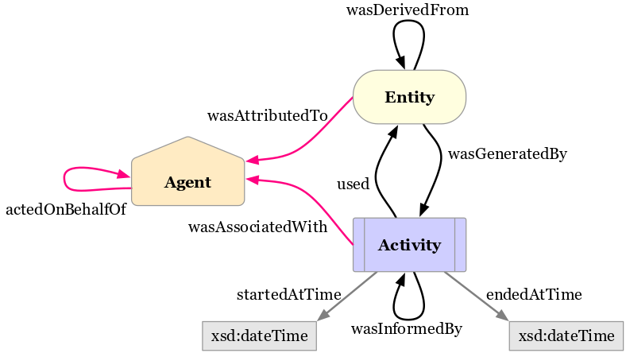
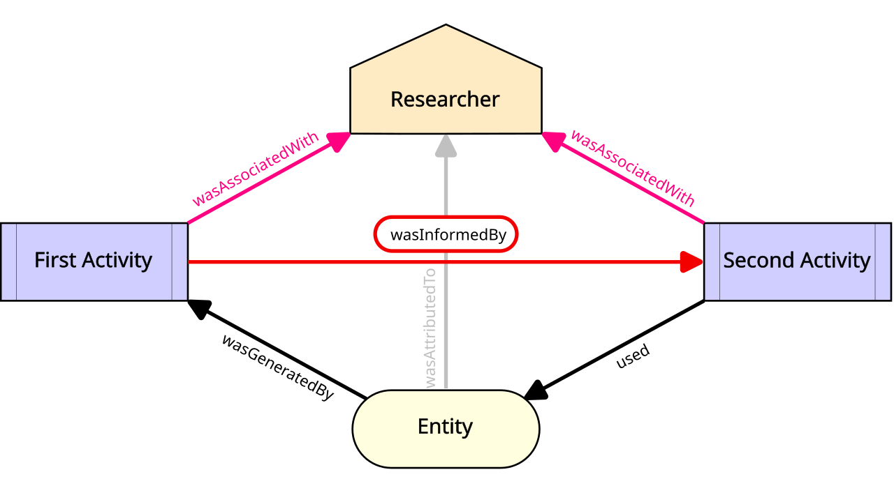
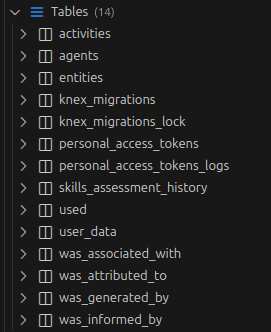
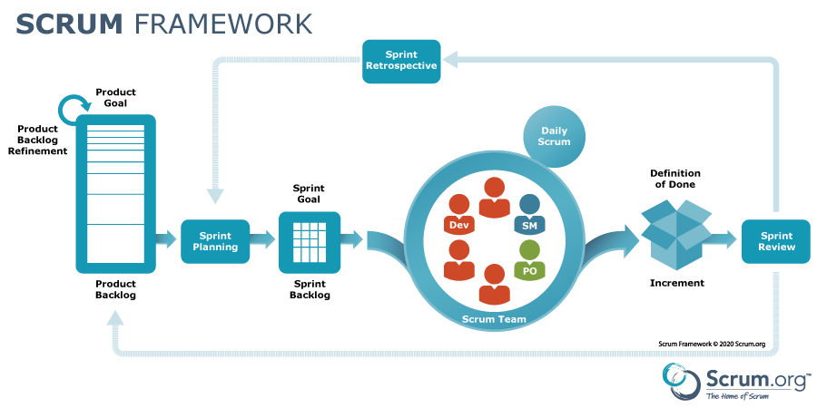
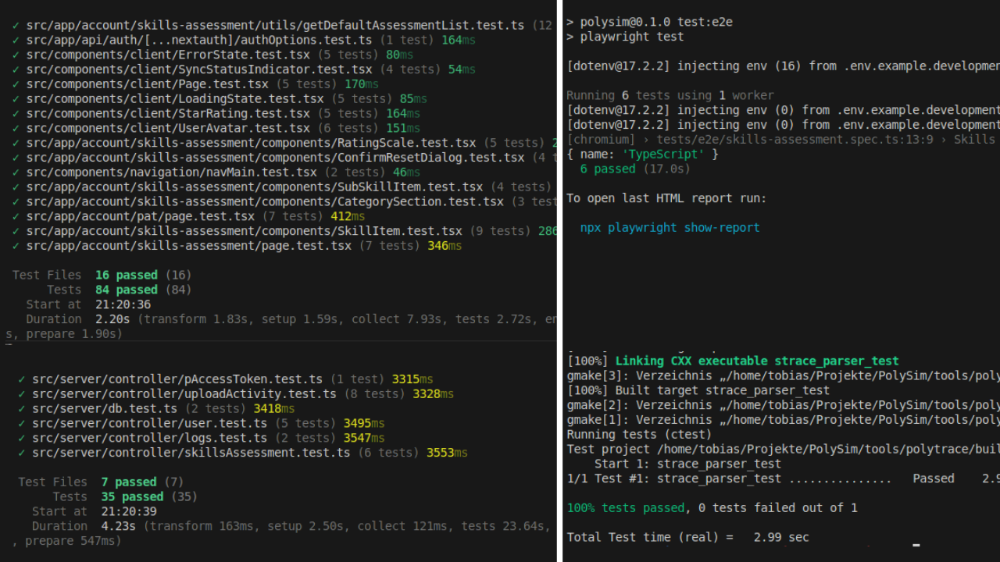

# Softwareengineering for Physicists

---

## Idea

Working on a **realistic-ish** project

Encounter irreducible **complexity**

Learn how to become a **team** 

---

## Our project

**Provenance** tracking for scientific simulations

---

First, we need to understand

**Provenance**

---

### FAIR Principles + Data Provenance

---

### What are FAIR Principles

- F – Findable (metadata, identifiers)
- A – Accessible (standards, protocols)
- I – Interoperable (tools, system)
- R – Reusable (structured)

---

### What is Data Provenance?

- Where data comes from
- How it was produced
- Who produced it
- What transformations were applied

*“How was this result created?”*
---

### W3C PROV Conceptual Model



---

<!-- ##  -->

<!-- --- -->
### Graph Representation Data in PolySim


---

### Importance of FAIR & Data Provenance in Scientific Simulations

- Reproducibility
- Debugging & Error Tracking
- Collaboration & Sharing
- Data Reuse & FAIR Compliance
- Automation & Workflow Management

---

### Tracking Data Provenance in Simulations

- Entity(Inputs)
- Agents(researchers, system )
- outputs(plots)

*Every result can be traced back to its origin*
---


Note: informedBy relationships can be inferred transitively. "Connecting the dots..."

---

**FAIR** enables reuse.

**Provenance** enables trust.

Together, they empower better science for researchers.

---

Our answer to **FAIR**

 ## PolySim 

**web application + CLI tool**   
<small>_to track provenance data for scientific simulations_</small>

---

## How to build a web app?

---

### By using other people's stuff

Whether **technical**...

- **Docker** containerization
- **Caddy** reverse proxy, ssl
- **Next.js** frontend+backend via trpc
- **PostgreSQL** database
- **Keycloak** authentication
---

... or **organizational**

- **git, CI/CD** GitHub Actions
- **best practices** code reviews, testing
- **agile methodologies** Scrum/Kanban

---

# Agile, Scrum & Kanban

---

## 1. What implies "AGILE" really?

Agile is **not a tool**. It is a **mindset**.

> "Responding to change over following a plan."
> -- Agile Manifesto (2001)

---

## 1. What implies "AGILE" really?


* **Uncertainty** 
* **Increments** 
* **People** Collaboration > Rigid Processes

Note:
- Software development is complex, not predictable
- We optimize for people, not for paperwork

---

## 2. The Tools

---

### Scrum (Structure)
*Rhythm & Roles*

* **Time-boxed:** Fixed Sprints 
* **Roles:** PO, Scrum Master, Developers
* **Loop:** Plan → Work → Review → Retro
* **Goal:** Alignment & Inspect/Adapt

---



---

### Kanban (Flow)
*Visualizing Work*

* **Visual Board:** To Do → Doing → Done
* **Pull Principle:** No pushing tasks onto people
* **WIP Limits:** Stop starting, start finishing
* **Goal:** Optimize flow, reduce bottlenecks

---

## Our Board

---

## 3. Why do we do this?

* **Large Work Packages**
    
* **Team Coordination**
    
* **Fighting Complexity**
    

---

## 4. How did this pan out for us?
### From Theory to Reality

---

### The Reality Check

We started with strict **Scrum**, but...

* **Constraint 1:** Unplanned work 
* **Constraint 2:** Time constraints 
* **Constraint 3:** Part-time nature

**Result:** Mismatch between process and reality.

---

## How we reacted

**Jugaad** 
> "Overcoming harsh constraints by improvising an effective solution using limited resources."

---

## Our Solution: Scrumban
*Flexibility & Adaptability*

---

## We combined the best of both worlds

*  **From Scrum (Structure):** 
    * "Daily" syncs & Retrospectives (Alignment)
    * Shared Responsibility

* **From Kanban (Flow):** 
    * Continuous refinement
    * **Pull-based** work (when time allows)
    * Flexible prioritizations

---

# Communication is Key

---

Also for machine _-to->_ human communication


aka **Logging**

---

## What next?

We **know** what we want to build

We **know** how we organize ourselves.

Now we need to **plan** the app.

---


---

 # KEYCLOAK HERE

---

 # VISUALIZATION HERE

---

# UPLOADING AVATARS HERE

---

## Visualization

- Good UI Matters
- Data without good Visuals is a bit useless
- The website should look nice and be easy to use

---


---


---

### We need to look at the Website!
---

###  How do we visualize things in our Website?

-  shadcn components based on React
	- Responsive
	- Design toolbox
- Tables
- Graph view of Provenance

---

### Challenges

- Dark mode
- Different component sources

---

## Notes

- Good UI Matters
- go through the way that the Data changes in each Step
- first Raw JSON
- after the Upload we can see the Data in our Database 
	- special Tool required to see it
- For a usable experience we need the Website
- Uses React Components
	- Useful for an Interactive Website
	- Performant rendering of interactive website parts
	- Able to do a global Darkmode
	- For consistency we take shadcn -- Industry standard website components
	- It for example Ships with a site wide Darkmode that we can use for our purpose (show)
- activities Table
- Graph view

---

#### Why Keycloak?

<div class="flow-grid-2x2">
    <div class="cell">
        <strong>Security is hard</strong><br>
        <span style="font-size: 0.8em">Don't build your own vault. Small mistakes lead to big hacks.</span>
    </div>
    <div class="cell">
        <strong>Trust the Pros</strong><br>
        <span style="font-size: 0.8em">Industry standard used by BMW & Cisco. Audited Open Source code.</span>
    </div>
    <div class="cell">
        <strong>Focus on App</strong><br>
        <span style="font-size: 0.8em">We skip building login pages/DBs and focus on PolySim features.</span>
    </div>
    <div class="cell">
        <strong>Our Auth Layer</strong><br>
        <span style="font-size: 0.8em">The "Security Guard" checking IDs before letting users in.</span>
    </div>
</div>

Note:
- **Context:** Why external service?
- **Analogy:** Don't build your own vault (Security = Complex)
- **Trust:** Industry Standard (CERN, Bundesagentur für Arbeit)
- **Role:** Keycloak is our "Auth Layer" (The Security Guard)
- **Benefit:** We focus on PolySim features, not password hashing

---

#### The Architecture: Next.js & Keycloak

<div class="flow-vertical">
    <div class="box">
        <strong>Docker Container (:8080)</strong><br>
        <span style="font-size: 0.8em">Keycloak runs completely separate from the App</span>
    </div>
    <div style="margin: 2px 0;">
        <span style="background: rgba(255,255,255,0.1); border: 1px dashed rgba(255,255,255,0.3); border-radius: 20px; padding: 5px 15px; font-size: 0.75em; color: var(--r-main-color);">
            ⬇️ via next-auth Bridge
        </span>
    </div>
    <div class="box">
        <strong>Next.js Application</strong><br>
        <span style="font-size: 0.8em">Never sees the password, only receives the "Ticket" (JWT)</span>
    </div>
</div>

<br>

**The Login Flow:**
<div class="flow-horizontal" style="margin-top: 10px;">
    <div class="box">Click "Login"</div>
    <div class="arrow">→</div>
    <div class="box">Redirect to Keycloak</div>
    <div class="arrow">→</div>
    <div class="box">Verify Creds</div>
    <div class="arrow">→</div>
    <div class="box">Back with Token</div>
</div>

Note:
- **Infrastructure:** Keycloak runs isolated (Docker Container).
- **Integration:** `next-auth` acts as the bridge.
- **The Flow:** Redirect -> Login External -> Return with Ticket (JWT).
- **Security:** Our App NEVER sees the password, only the token.

---

#### Implementing Avatar Upload

**The Evolution: From File Input to Dialog**

| Feature | Version 1 (Generic) | Version 2 (Refined) |
| :--- | :--- | :--- |
| **Component** | Standard Shadcn Input | **Dedicated Modal (Dialog)** |
| **Feedback** | Filename only | **Live Image Preview** |
| **UX** | "Is it uploaded?" | Explicit "Confirm" Action |

<div class="fragment flow-horizontal" style="margin-top: 30px; font-size: 0.8em;">
    <div class="box">Sidebar<br>Avatar</div>
    <div class="arrow">→</div>
    <div class="box">Account<br>Page</div>
    <div class="arrow">→</div>
    <div class="box">Upload<br>Dialog</div>
    <div class="arrow">→</div>
    <div class="box" style="border-color: #bae6fd;">Preview<br>& Confirm</div>
</div>

Note:
- **Evolution:** Moved from generic input to custom Dialog
- **UX Key:** Live Preview is crucial for user confidence
- **Workflow:** Select -> Preview -> Confirm
- **Why:** Prevents errors, feels more "App-like"

---

#### Avatar Data Lifecycle

**Problem:** How to store images without external storage (S3)?
**Solution:** Store directly in Postgres as Base64.

<div class="flow-vertical" style="margin-top: 20px;">
    <div class="flow-horizontal">
        <div class="box">
            <strong>Frontend (Image)</strong><br>
            <span style="font-size: 0.7em">User selects file</span>
        </div>
        <div class="arrow">→</div>
        <div class="box" style="background: rgba(255,255,255,0.15);">
            <strong>Base64 Conversion</strong><br>
            <span style="font-size: 0.7em">Image to String</span>
        </div>
        <div class="arrow">→</div>
        <div class="box">
            <strong>tRPC Mutation</strong><br>
            <span style="font-size: 0.7em">Type-safe transfer</span>
        </div>
        <div class="arrow">→</div>
        <div class="box">
            <strong>Database</strong><br>
            <span style="font-size: 0.7em">Stored as Text</span>
        </div>
    </div>
</div>

<div class="fragment" style="margin-top: 30px;">
    <strong>Retrieval:</strong> <br>
    The browser receives the string via <strong>tRPC Query</strong> and renders it back to an image automatically.
    <br><br>
    <em>Using Shadcn Avatar Component for consistent circular display & Fallback initials.</em>
</div>

Note:
- **Challenge:** No S3/Cloud storage available
- **Technique:** Base64 (Convert Image -> Long Text String)
- **Pipeline:** Frontend -> tRPC Mutation -> Postgres DB
- **Retrieval:** tRPC Query -> Browser renders string automatically
- **UI:** Shadcn Avatar handles Fallbacks (Initials)

---

#### Experience & Demo

**Lessons Learned:**
*   **Complexity:** Managing async State (Upload -> Preview -> Server) is tricky.
*   **Base64:** Handling large strings on the client requires care.
*   **UI Updates:** Ensuring the avatar updates immediately in the sidebar.

<br>

### 🎯 Live Demo Points
1.  **Keycloak Container** (Port :8080)
2.  **The Login Redirect** (App -> Auth -> App)
3.  **Avatar Upload** (Preview Feature)

Note:
- **Lesson:** Simple features != Simple code (Async state is tricky)
- **Technical:** Handling Base64 strings on client
- **DEMO ROADMAP:**
    1. Show Docker Container (:8080)
    2. Perform Login (Redirect flow)
    3. Show Upload Dialog & Preview

---

## Bridging frontend & backend

---

### Next.js + tRPC 

**Type-Safe Full-Stack**

**Next.js** = Folder -> Route mapping

**trpc** = frontend<->backend as simple as (typed) function

 **easy** internal and public API development   


---

# Personal Access Tokens (PATs)

---

## Authentication for the Public API

For CLI tools like **PolyTrace**, we need a secure authentication method:

- Non-interactive login
- Classic solution: **Personal Access Tokens**

---

## What are Personal Access Tokens?

A **PAT** is a long-lived token for API authentication.

Key characteristics:

- Generated by backend, shown **once**
- Stored **hashed** on server
- Sent via `Authorization` header
- Alternative to username/password

---

## Why Use PATs?

#### Non-interactive Authentication

Automated systems (CLI tools, scripts) cannot perform interactive logins.

#### Least-Privilege Access

PATs can be scoped with specific permissions.

#### Safe Revocation

Compromising a PAT doesn't require resetting the user's password.

#### Auditing

Each PAT can be tracked independently (creation time, last usage)

---

## Token Generation Workflow

<div style="display: grid; grid-template-columns: 1fr 1fr; gap: 2rem; max-width: 900px; margin: 2rem auto; position: relative;">
  <div class="box fragment" data-fragment-index="1" style="grid-column: 1; grid-row: 1;"><strong>1. Random bytes</strong><br/>64 bytes → hex</div>
  <div class="fragment" data-fragment-index="2" style="position: absolute; top: 20%; left: 48%; font-size: 2rem; color: #0ea5e9;">→</div>
  <div class="box fragment" data-fragment-index="2" style="grid-column: 2; grid-row: 1;"><strong>2. Token</strong><br/><code>a3f2...8d1c</code></div>
  <div class="fragment" data-fragment-index="3" style="position: absolute; top: 45%; right: 8%; font-size: 2rem; color: #0ea5e9;">↓</div>
  <div class="box fragment" data-fragment-index="3" style="grid-column: 2; grid-row: 2;"><strong>3. HMAC</strong><br/>+ secret "blablabla" → <code>7c8e...</code></div>
  <div class="fragment" data-fragment-index="4" style="position: absolute; bottom: 20%; left: 48%; font-size: 2rem; color: #0ea5e9;">←</div>
  <div class="box fragment" data-fragment-index="4" style="grid-column: 1; grid-row: 2;"><strong>4. SHA-256</strong><br/><code>2f1a...</code> (stored in DB)</div>
</div>

---

## Security: Double Hashing

**Why HMAC + SHA-256?**

**HMAC with server secret**

- Secret in env vars only
- Never exposed to clients/DB
- Prevents rainbow tables

**SHA-256 hash**

- Stored in PostgreSQL
- One-way, cannot recover token

---

## Code Implementation

```javascript
const token = crypto.randomBytes(64).toString('hex');
const hmac = crypto.createHmac('sha256', process.env.SERVER_SECRET);
const salted = hmac.update(token).digest('hex');
const hash = crypto.createHash('sha256').update(salted).digest('hex');
// Store hash in DB, show token to user ONCE
```

---

## How We Use PATs in PolySim

1. User generates PAT via web interface
2. Token shown **once** (store locally)
3. PolyTrace sends PAT in requests
4. Server validates and grants access

**Use case:** Upload provenance from PolyTrace

---

## Backend Authentication Flow

1. Client sends PAT in `Authorization` header
2. Server applies HMAC + SHA-256
3. Compare with stored hash in PostgreSQL
4. If valid: Inject user into tRPC context
5. Procedures use context for auth

```javascript
const userId = getUserIdFromContext(ctx);
```

---

**public API** secured with **PATs**!

-> http://localhost:3000/api-doc

---


## PolyTrace and Uploader

---

## What is PolyTrace?

A CLI tool to record filesystem activity

---

<div class="flow-horizontal">
   <div class="box fragment"><strong>Run PolyTrace</strong><br/>executes the target program</div>
   <div class="arrow fragment">→</div>
   <div class="box fragment"><strong>Execute</strong><br/> target and child processes</div>
   <div class="arrow fragment">→</div>
   <div class="box fragment"><strong>Trace</strong><br/>filesystem actions (I/O)</div>
   <div class="arrow fragment">→</div>
   <div class="box fragment"><strong>Export</strong><br/>hash traced files with timestamps to create<code>PROV</code> file</div>
   <div class="arrow fragment">→</div>
   <div class="box fragment"><strong>Upload</strong><br/>uploader expects a PAT to upload the <code>PROV</code> file</div>		
</div>
---
<section class = compact>
   <h2>Platform support</h2>

   <table class="os-table">
      <thead>
      <tr>
         <th>OS</th>
         <th>How PolyTrace traces filesystem activity</th>
      </tr>
      </thead>
      <tbody>
      <tr>
         <td>Linux</td>
         <td>
         Uses <code>strace</code>
         </td>
      </tr>
      <tr>
         <td>Windows</td>
         <td>
         Uses <code>strace</code> via <strong>WSL</strong>
         </td>
      </tr>
      <tr>
         <td>macOS</td>
         <td>
         Uses <code>fs_usage</code> with some limitations
         </td>
      </tr>
      <tr></tr>
      </tbody>
   </table>
   </section>
---

## PolyTrace Pipeline

<div class="flow-stack flow-scroll">
  <div class="flow-layer flow-grid-2x2 fragment fade-out flow-shift-out" data-fragment-index="4">
    <div class="cell fragment" data-fragment-index="1"><strong>PolyTrace executes target program</strong></div>
    <div class="cell arrow-left fragment" data-fragment-index="2">
      <div class="r-stack">
        <div class="fragment fade-out" data-fragment-index="3"><strong>strace output</strong></div>
        <div class="fragment" data-fragment-index="3"><strong>fs_usage output</strong></div>
      </div>
    </div>
    <div class="cell code-cell fragment" data-fragment-index="1">
      <pre><code> #!/bin/sh
BASE_DIR=$(cd "$(dirname "$0")" && pwd)
OUT="$BASE_DIR/tmp/simple_run_out"
rm -f "$OUT"
cat /etc/ld.so.cache > /dev/null 2>/dev/null || true
echo hello > "$OUT"
sleep 0.01
exit 0</code></pre>
    </div>
    <div class="cell code-cell fragment" data-fragment-index="2">
      <div class="r-stack">
        <div class="fragment fade-out" data-fragment-index="3">
          <pre><code>1769772754.266682 --- SIGCHLD {si_signo=SIGCHLD, si_code=CLD_EXITED, si_pid=960733, si_uid=1000, si_status=0, si_utime=0, si_stime=0} ---
1769772754.266720 chdir("/home/tobias/Projekte/PolySim/tools/polytrace/test/fixtures") = 0
1769772754.266818 +++ exited with 0 +++
1769772754.265826 newfstatat(AT_FDCWD</home/tobias/Projekte/PolySim/tools/polytrace>, "/home/tobias/.sdkman/candidates/java/current/bin/dirname", 0x7ffc1d955610, 0) = -1 ENOENT (Datei oder Verzeichnis nicht gefunden)
1769772754.265864 newfstatat(AT_FDCWD</home/tobias/Projekte/PolySim/tools/polytrace>, "/home/tobias/.nvm/versions/node/v24.9.0/bin/dirname", 0x7ffc1d955610, 0) = -1 ENOENT (Datei oder Verzeichnis nicht gefunden)
1769772754.265880 newfstatat(AT_FDCWD</home/tobias/Projekte/PolySim/tools/polytrace>, "/home/tobias/.local/bin/dirname", 0x7ffc1d955610, 0) = -1 ENOENT (Datei oder Verzeichnis nicht gefunden)
1769772754.265894 newfstatat(AT_FDCWD</home/tobias/Projekte/PolySim/tools/polytrace>, "/usr/local/sbin/dirname", 0x7ffc1d955610, 0) = -1 ENOENT (Datei oder Verzeichnis nicht gefunden)
1769772754.265908 newfstatat(AT_FDCWD</home/tobias/Projekte/PolySim/tools/polytrace>, "/usr/local/bin/dirname", 0x7ffc1d955610, 0) = -1 ENOENT (Datei oder Verzeichnis nicht gefunden)
1769772754.265922 newfstatat(AT_FDCWD</home/tobias/Projekte/PolySim/tools/polytrace>, "/usr/sbin/dirname", 0x7ffc1d955610, 0) = -1 ENOENT (Datei oder Verzeichnis nicht gefunden)
1769772754.265935 newfstatat(AT_FDCWD</home/tobias/Projekte/PolySim/tools/polytrace>, "/usr/bin/dirname", {st_mode=S_IFREG|0755, st_size=35208, ...}, 0) = 0
1769772754.265955 execve("/usr/bin/dirname", ["dirname", "test/fixtures/simple_run.sh"], 0x5cd2a5f43598 /* 78 vars */) = 0
1769772754.266179 access("/etc/ld.so.preload", R_OK) = -1 ENOENT (Datei oder Verzeichnis nicht gefunden)
1769772754.266194 openat(AT_FDCWD</home/tobias/Projekte/PolySim/tools/polytrace>, "/etc/ld.so.cache", O_RDONLY|O_CLOEXEC) = 3</etc/ld.so.cache>
1769772754.266242 openat(AT_FDCWD</home/tobias/Projekte/PolySim/tools/polytrace>, "/lib/x86_64-linux-gnu/libc.so.6", O_RDONLY|O_CLOEXEC) = 3</usr/lib/x86_64-linux-gnu/libc.so.6>
1769772754.266515 openat(AT_FDCWD</home/tobias/Projekte/PolySim/tools/polytrace>, "/usr/lib/locale/locale-archive", O_RDONLY|O_CLOEXEC) = 3</usr/lib/locale/locale-archive>
1769772754.266671 +++ exited with 0 +++
1769772754.263656 execve("test/fixtures/simple_run.sh", ["test/fixtures/simple_run.sh"], 0x7ffe5dddec40 /* 78 vars */) = 0
1769772754.264033 access("/etc/ld.so.preload", R_OK) = -1 ENOENT (Datei oder Verzeichnis nicht gefunden)
1769772754.264169 openat(AT_FDCWD</home/tobias/Projekte/PolySim/tools/polytrace>, "/etc/ld.so.cache", O_RDONLY|O_CLOEXEC) = 3</etc/ld.so.cache>
1769772754.264444 openat(AT_FDCWD</home/tobias/Projekte/PolySim/tools/polytrace>, "/lib/x86_64-linux-gnu/libc.so.6", O_RDONLY|O_CLOEXEC) = 3</usr/lib/x86_64-linux-gnu/libc.so.6>
1769772754.265159 newfstatat(AT_FDCWD</home/tobias/Projekte/PolySim/tools/polytrace>, "/home/tobias/Projekte/PolySim/tools/polytrace", {st_mode=S_IFDIR|0775, st_size=4096, ...}, 0) = 0
1769772754.265203 newfstatat(AT_FDCWD</home/tobias/Projekte/PolySim/tools/polytrace>, ".", {st_mode=S_IFDIR|0775, st_size=4096, ...}, 0) = 0
1769772754.265221 openat(AT_FDCWD</home/tobias/Projekte/PolySim/tools/polytrace>, "test/fixtures/simple_run.sh", O_RDONLY) = 3</home/tobias/Projekte/PolySim/tools/polytrace/test/fixtures/simple_run.sh>
1769772754.266843 --- SIGCHLD {si_signo=SIGCHLD, si_code=CLD_EXITED, si_pid=960732, si_uid=1000, si_status=0, si_utime=0, si_stime=0} ---
1769772754.266945 newfstatat(AT_FDCWD</home/tobias/Projekte/PolySim/tools/polytrace>, "/home/tobias/.sdkman/candidates/java/current/bin/rm", 0x7ffc1d955c20, 0) = -1 ENOENT (Datei oder Verzeichnis nicht gefunden)
1769772754.266993 newfstatat(AT_FDCWD</home/tobias/Projekte/PolySim/tools/polytrace>, "/home/tobias/.nvm/versions/node/v24.9.0/bin/rm", 0x7ffc1d955c20, 0) = -1 ENOENT (Datei oder Verzeichnis nicht gefunden)
1769772754.267025 newfstatat(AT_FDCWD</home/tobias/Projekte/PolySim/tools/polytrace>, "/home/tobias/.local/bin/rm", 0x7ffc1d955c20, 0) = -1 ENOENT (Datei oder Verzeichnis nicht gefunden)
1769772754.267054 newfstatat(AT_FDCWD</home/tobias/Projekte/PolySim/tools/polytrace>, "/usr/local/sbin/rm", 0x7ffc1d955c20, 0) = -1 ENOENT (Datei oder Verzeichnis nicht gefunden)
1769772754.267082 newfstatat(AT_FDCWD</home/tobias/Projekte/PolySim/tools/polytrace>, "/usr/local/bin/rm", 0x7ffc1d955c20, 0) = -1 ENOENT (Datei oder Verzeichnis nicht gefunden)
1769772754.267110 newfstatat(AT_FDCWD</home/tobias/Projekte/PolySim/tools/polytrace>, "/usr/sbin/rm", 0x7ffc1d955c20, 0) = -1 ENOENT (Datei oder Verzeichnis nicht gefunden)
1769772754.267142 newfstatat(AT_FDCWD</home/tobias/Projekte/PolySim/tools/polytrace>, "/usr/bin/rm", {st_mode=S_IFREG|0755, st_size=59912, ...}, 0) = 0
1769772754.268733 --- SIGCHLD {si_signo=SIGCHLD, si_code=CLD_EXITED, si_pid=960734, si_uid=1000, si_status=0, si_utime=0, si_stime=0} ---
1769772754.268788 openat(AT_FDCWD</home/tobias/Projekte/PolySim/tools/polytrace>, "/dev/null", O_WRONLY|O_CREAT|O_TRUNC, 0666) = 3</dev/null>
1769772754.268897 openat(AT_FDCWD</home/tobias/Projekte/PolySim/tools/polytrace>, "/dev/null", O_WRONLY|O_CREAT|O_TRUNC, 0666) = 3</dev/null>
1769772754.268994 newfstatat(AT_FDCWD</home/tobias/Projekte/PolySim/tools/polytrace>, "/home/tobias/.sdkman/candidates/java/current/bin/cat", 0x7ffc1d955bb0, 0) = -1 ENOENT (Datei oder Verzeichnis nicht gefunden)
1769772754.269040 newfstatat(AT_FDCWD</home/tobias/Projekte/PolySim/tools/polytrace>, "/home/tobias/.nvm/versions/node/v24.9.0/bin/cat", 0x7ffc1d955bb0, 0) = -1 ENOENT (Datei oder Verzeichnis nicht gefunden)
1769772754.269072 newfstatat(AT_FDCWD</home/tobias/Projekte/PolySim/tools/polytrace>, "/home/tobias/.local/bin/cat", 0x7ffc1d955bb0, 0) = -1 ENOENT (Datei oder Verzeichnis nicht gefunden)
1769772754.269102 newfstatat(AT_FDCWD</home/tobias/Projekte/PolySim/tools/polytrace>, "/usr/local/sbin/cat", 0x7ffc1d955bb0, 0) = -1 ENOENT (Datei oder Verzeichnis nicht gefunden)
1769772754.269131 newfstatat(AT_FDCWD</home/tobias/Projekte/PolySim/tools/polytrace>, "/usr/local/bin/cat", 0x7ffc1d955bb0, 0) = -1 ENOENT (Datei oder Verzeichnis nicht gefunden)
1769772754.269171 newfstatat(AT_FDCWD</home/tobias/Projekte/PolySim/tools/polytrace>, "/usr/sbin/cat", 0x7ffc1d955bb0, 0) = -1 ENOENT (Datei oder Verzeichnis nicht gefunden)
1769772754.269202 newfstatat(AT_FDCWD</home/tobias/Projekte/PolySim/tools/polytrace>, "/usr/bin/cat", {st_mode=S_IFREG|0755, st_size=39384, ...}, 0) = 0
1769772754.270649 --- SIGCHLD {si_signo=SIGCHLD, si_code=CLD_EXITED, si_pid=960736, si_uid=1000, si_status=0, si_utime=0, si_stime=0} ---
1769772754.270768 openat(AT_FDCWD</home/tobias/Projekte/PolySim/tools/polytrace>, "/home/tobias/Projekte/PolySim/tools/polytrace/test/fixtures/tmp/simple_run_out", O_WRONLY|O_CREAT|O_TRUNC, 0666) = 3</home/tobias/Projekte/PolySim/tools/polytrace/test/fixtures/tmp/simple_run_out>
1769772754.270955 newfstatat(AT_FDCWD</home/tobias/Projekte/PolySim/tools/polytrace>, "/home/tobias/.sdkman/candidates/java/current/bin/sleep", 0x7ffc1d955c20, 0) = -1 ENOENT (Datei oder Verzeichnis nicht gefunden)
1769772754.271009 newfstatat(AT_FDCWD</home/tobias/Projekte/PolySim/tools/polytrace>, "/home/tobias/.nvm/versions/node/v24.9.0/bin/sleep", 0x7ffc1d955c20, 0) = -1 ENOENT (Datei oder Verzeichnis nicht gefunden)
1769772754.271033 newfstatat(AT_FDCWD</home/tobias/Projekte/PolySim/tools/polytrace>, "/home/tobias/.local/bin/sleep", 0x7ffc1d955c20, 0) = -1 ENOENT (Datei oder Verzeichnis nicht gefunden)
1769772754.271047 newfstatat(AT_FDCWD</home/tobias/Projekte/PolySim/tools/polytrace>, "/usr/local/sbin/sleep", 0x7ffc1d955c20, 0) = -1 ENOENT (Datei oder Verzeichnis nicht gefunden)
1769772754.271062 newfstatat(AT_FDCWD</home/tobias/Projekte/PolySim/tools/polytrace>, "/usr/local/bin/sleep", 0x7ffc1d955c20, 0) = -1 ENOENT (Datei oder Verzeichnis nicht gefunden)
1769772754.271076 newfstatat(AT_FDCWD</home/tobias/Projekte/PolySim/tools/polytrace>, "/usr/sbin/sleep", 0x7ffc1d955c20, 0) = -1 ENOENT (Datei oder Verzeichnis nicht gefunden)
1769772754.271090 newfstatat(AT_FDCWD</home/tobias/Projekte/PolySim/tools/polytrace>, "/usr/bin/sleep", {st_mode=S_IFREG|0755, st_size=35336, ...}, 0) = 0
1769772754.283708 --- SIGCHLD {si_signo=SIGCHLD, si_code=CLD_EXITED, si_pid=960738, si_uid=1000, si_status=0, si_utime=0, si_stime=0} ---
1769772754.283910 +++ exited with 0 +++
1769772754.269374 execve("/usr/bin/cat", ["cat", "/etc/ld.so.cache"], 0x5cd2a5f43ae8 /* 78 vars */) = 0
1769772754.269693 access("/etc/ld.so.preload", R_OK) = -1 ENOENT (Datei oder Verzeichnis nicht gefunden)
1769772754.269714 openat(AT_FDCWD</home/tobias/Projekte/PolySim/tools/polytrace>, "/etc/ld.so.cache", O_RDONLY|O_CLOEXEC) = 3</etc/ld.so.cache>
1769772754.269780 openat(AT_FDCWD</home/tobias/Projekte/PolySim/tools/polytrace>, "/lib/x86_64-linux-gnu/libc.so.6", O_RDONLY|O_CLOEXEC) = 3</usr/lib/x86_64-linux-gnu/libc.so.6>
1769772754.270157 openat(AT_FDCWD</home/tobias/Projekte/PolySim/tools/polytrace>, "/usr/lib/locale/locale-archive", O_RDONLY|O_CLOEXEC) = 3</usr/lib/locale/locale-archive>
1769772754.270392 openat(AT_FDCWD</home/tobias/Projekte/PolySim/tools/polytrace>, "/etc/ld.so.cache", O_RDONLY) = 3</etc/ld.so.cache>
1769772754.270623 +++ exited with 0 +++
1769772754.267353 execve("/usr/bin/rm", ["rm", "-f", "/home/tobias/Projekte/PolySim/tools/polytrace/test/fixtures/tmp/simple_run_out"], 0x5cd2a5f43678 /* 78 vars */) = 0
1769772754.267640 access("/etc/ld.so.preload", R_OK) = -1 ENOENT (Datei oder Verzeichnis nicht gefunden)
1769772754.267676 openat(AT_FDCWD</home/tobias/Projekte/PolySim/tools/polytrace>, "/etc/ld.so.cache", O_RDONLY|O_CLOEXEC) = 3</etc/ld.so.cache>
1769772754.267780 openat(AT_FDCWD</home/tobias/Projekte/PolySim/tools/polytrace>, "/lib/x86_64-linux-gnu/libc.so.6", O_RDONLY|O_CLOEXEC) = 3</usr/lib/x86_64-linux-gnu/libc.so.6>
1769772754.268298 openat(AT_FDCWD</home/tobias/Projekte/PolySim/tools/polytrace>, "/usr/lib/locale/locale-archive", O_RDONLY|O_CLOEXEC) = 3</usr/lib/locale/locale-archive>
1769772754.268436 newfstatat(AT_FDCWD</home/tobias/Projekte/PolySim/tools/polytrace>, "/home/tobias/Projekte/PolySim/tools/polytrace/test/fixtures/tmp/simple_run_out", {st_mode=S_IFREG|0664, st_size=6, ...}, AT_SYMLINK_NOFOLLOW) = 0
1769772754.268475 unlinkat(AT_FDCWD</home/tobias/Projekte/PolySim/tools/polytrace>, "/home/tobias/Projekte/PolySim/tools/polytrace/test/fixtures/tmp/simple_run_out", 0) = 0
1769772754.268706 +++ exited with 0 +++
1769772754.271726 execve("/usr/bin/sleep", ["sleep", "0.01"], 0x5cd2a5f45ed8 /* 78 vars */) = 0
1769772754.272184 access("/etc/ld.so.preload", R_OK) = -1 ENOENT (Datei oder Verzeichnis nicht gefunden)
1769772754.272216 openat(AT_FDCWD</home/tobias/Projekte/PolySim/tools/polytrace>, "/etc/ld.so.cache", O_RDONLY|O_CLOEXEC) = 3</etc/ld.so.cache>
1769772754.272279 openat(AT_FDCWD</home/tobias/Projekte/PolySim/tools/polytrace>, "/lib/x86_64-linux-gnu/libc.so.6", O_RDONLY|O_CLOEXEC) = 3</usr/lib/x86_64-linux-gnu/libc.so.6>
1769772754.272603 openat(AT_FDCWD</home/tobias/Projekte/PolySim/tools/polytrace>, "/usr/lib/locale/locale-archive", O_RDONLY|O_CLOEXEC) = 3</usr/lib/locale/locale-archive>
1769772754.272672 openat(AT_FDCWD</home/tobias/Projekte/PolySim/tools/polytrace>, "/usr/share/locale/locale.alias", O_RDONLY|O_CLOEXEC) = 3</etc/locale.alias>
1769772754.272744 openat(AT_FDCWD</home/tobias/Projekte/PolySim/tools/polytrace>, "/usr/share/locale/de_DE.UTF-8/LC_MESSAGES/coreutils.mo", O_RDONLY) = -1 ENOENT (Datei oder Verzeichnis nicht gefunden)
1769772754.272761 openat(AT_FDCWD</home/tobias/Projekte/PolySim/tools/polytrace>, "/usr/share/locale/de_DE.utf8/LC_MESSAGES/coreutils.mo", O_RDONLY) = -1 ENOENT (Datei oder Verzeichnis nicht gefunden)
1769772754.272776 openat(AT_FDCWD</home/tobias/Projekte/PolySim/tools/polytrace>, "/usr/share/locale/de_DE/LC_MESSAGES/coreutils.mo", O_RDONLY) = -1 ENOENT (Datei oder Verzeichnis nicht gefunden)
1769772754.272792 openat(AT_FDCWD</home/tobias/Projekte/PolySim/tools/polytrace>, "/usr/share/locale/de.UTF-8/LC_MESSAGES/coreutils.mo", O_RDONLY) = -1 ENOENT (Datei oder Verzeichnis nicht gefunden)
1769772754.272806 openat(AT_FDCWD</home/tobias/Projekte/PolySim/tools/polytrace>, "/usr/share/locale/de.utf8/LC_MESSAGES/coreutils.mo", O_RDONLY) = -1 ENOENT (Datei oder Verzeichnis nicht gefunden)
1769772754.272821 openat(AT_FDCWD</home/tobias/Projekte/PolySim/tools/polytrace>, "/usr/share/locale/de/LC_MESSAGES/coreutils.mo", O_RDONLY) = -1 ENOENT (Datei oder Verzeichnis nicht gefunden)
1769772754.272836 openat(AT_FDCWD</home/tobias/Projekte/PolySim/tools/polytrace>, "/usr/share/locale-langpack/de_DE.UTF-8/LC_MESSAGES/coreutils.mo", O_RDONLY) = -1 ENOENT (Datei oder Verzeichnis nicht gefunden)
1769772754.272850 openat(AT_FDCWD</home/tobias/Projekte/PolySim/tools/polytrace>, "/usr/share/locale-langpack/de_DE.utf8/LC_MESSAGES/coreutils.mo", O_RDONLY) = -1 ENOENT (Datei oder Verzeichnis nicht gefunden)
1769772754.272865 openat(AT_FDCWD</home/tobias/Projekte/PolySim/tools/polytrace>, "/usr/share/locale-langpack/de_DE/LC_MESSAGES/coreutils.mo", O_RDONLY) = -1 ENOENT (Datei oder Verzeichnis nicht gefunden)
1769772754.272879 openat(AT_FDCWD</home/tobias/Projekte/PolySim/tools/polytrace>, "/usr/share/locale-langpack/de.UTF-8/LC_MESSAGES/coreutils.mo", O_RDONLY) = -1 ENOENT (Datei oder Verzeichnis nicht gefunden)
1769772754.272893 openat(AT_FDCWD</home/tobias/Projekte/PolySim/tools/polytrace>, "/usr/share/locale-langpack/de.utf8/LC_MESSAGES/coreutils.mo", O_RDONLY) = -1 ENOENT (Datei oder Verzeichnis nicht gefunden)
1769772754.272907 openat(AT_FDCWD</home/tobias/Projekte/PolySim/tools/polytrace>, "/usr/share/locale-langpack/de/LC_MESSAGES/coreutils.mo", O_RDONLY) = 3</usr/share/locale-langpack/de/LC_MESSAGES/coreutils.mo>
1769772754.272975 openat(AT_FDCWD</home/tobias/Projekte/PolySim/tools/polytrace>, "/usr/lib/x86_64-linux-gnu/gconv/gconv-modules.cache", O_RDONLY|O_CLOEXEC) = 3</usr/lib/x86_64-linux-gnu/gconv/gconv-modules.cache>
1769772754.283591 +++ exited with 0 +++

</code></pre>

</div>

<div class="fragment" data-fragment-index="3">
<pre><code>17:31:54.814998 fsgetpath /usr/lib/dyld 0.000038 simple_run.6475663
17:31:54.815776 fsgetpath /usr/lib/dyld 0.000019 simple_run.6475663
17:31:54.816178 open F=3 (R******\_\_******) . 0.000098 simple_run.6475663
17:31:54.816182 fcntl F=3 <GETPATH> 0.000004 simple_run.6475663
17:31:54.816187 close F=3 0.000005 simple_run.6475663
17:31:54.816197 fsgetpath /Users/efemyuksel/PolySim/tools/polytrace/test/fixtures/simple_run 0.000008 simple_run.6475663
17:31:54.816213 fsgetpath /usr/lib/dyld 0.000015 simple_run.6475663
17:31:54.816345 open F=3 (R****\_\_\_****f**) 0.000030 simple_run.6475663
17:31:54.816396 openat F=4 (R****\_\_\_\_******) [3]/../../System/Volumes/Preboot/Cryptexes/OS 0.000050 simple_run.6475663
17:31:54.816415 fstatat64 [4]/System/Library/dyld 0.000012 simple_run.6475663
17:31:54.816440 openat F=6 (R******\_\_******) [4]/System/Library/dyld 0.000024 simple_run.6475663
17:31:54.816444 fcntl F=6 <GETPATH> 0.000003 simple_run.6475663
17:31:54.816451 close F=3 0.000003 simple_run.6475663
17:31:54.816452 close F=5 0.000001 simple_run.6475663
17:31:54.816454 close F=4 0.000001 simple_run.6475663
17:31:54.816455 close F=6 0.000001 simple_run.6475663
17:31:54.816480 fsgetpath /System/Volumes/Preboot/Cryptexes/OS/System/Library/dyld/dyld_shared_cache_arm64e 0.000008 simple_run.6475663
17:31:54.816483 fcntl F=8 <GETPATH> 0.000002 simple_run.6475663
17:31:54.816487 close F=8 0.000002 simple_run.6475663
17:31:54.816489 close F=7 0.000002 simple_run.6475663
17:31:54.816534 stat64 /Users/efemyuksel/PolySim/tools/polytrace/test/fixtures/simple_run 0.000012 simple_run.6475663
17:31:54.816599 open F=3 (R******\_\_******) /Users/efemyuksel/PolySim/tools/polytrace/test/fixtures/simple_run 0.000064 simple_run.6475663
17:31:54.816635 fcntl F=3 <GETPATH> 0.000003 simple_run.6475663
17:31:54.816651 close F=3 0.000003 simple_run.6475663
17:31:54.816662 stat64 /Users/efemyuksel/PolySim/tools/polytrace/test/fixtures/simple_run 0.000011 simple_run.6475663
17:31:54.816694 stat64 [ 2] /usr/lib/libc++.1.dylib 0.000005 simple_run.6475663
17:31:54.816720 stat64 [ 2] /System/Volumes/Preboot/Cryptexes/OS/usr/lib/libc++.1.dylib 0.000011 simple_run.6475663
17:31:54.816751 stat64 [ 2] /usr/lib/libSystem.B.dylib 0.000007 simple_run.6475663
17:31:54.816763 stat64 [ 2] /System/Volumes/Preboot/Cryptexes/OS/usr/lib/libSystem.B.dylib 0.000004 simple_run.6475663
17:31:54.817614 open F=3 (R******\_\_******) /Users/efemyuksel/PolySim/tools/polytrace/test/fixtures/simple_run 0.000059 simple_run.6475663
17:31:54.817653 close F=3 0.000002 simple_run.6475663
17:31:54.817891 getfsstat64 0.000006 simple_run.6475663
17:31:54.817913 getfsstat64 0.000014 simple_run.6475663
17:31:54.817929 getattrlist 0.000015 simple_run.6475663
17:31:54.818177 open F=3 (RW******\_******) /dev/dtracehelper 0.000092 simple_run.6475663
17:31:54.818207 ioctl F=3 <CMD=0x80086804> 0.000030 simple_run.6475663
17:31:54.818216 close F=3 0.000009 simple_run.6475663
17:31:54.818271 access [ 2] (**_F) /AppleInternal/XBS/.isChrooted 0.000005 simple_run.6475663
17:31:54.818451 fstat64 F=3 0.000002 simple_run.6475663
17:31:54.818466 close F=3 0.000002 simple_run.6475663
17:31:54.818533 ioctl F=2 <CMD=0x4004667a> 0.000003 simple_run.6475663
17:31:54.819107 getattrlist /Users/efemyuksel/PolySim/tools/polytrace/test/fixtures/simple_run 0.000026 simple_run.6475663
17:31:54.819169 access (R_**) /Users/efemyuksel/PolySim/tools/polytrace/test/fixtures 0.000060 simple_run.6475663
17:31:54.819204 open F=3 (R******\_\_******) /Users/efemyuksel/PolySim/tools/polytrace/test/fixtures 0.000035 simple_run.6475663
17:31:54.819206 fstat64 F=3 0.000002 simple_run.6475663
17:31:54.819221 fgetattrlist F=3 0.000014 simple_run.6475663
17:31:54.819263 fcntl F=3 <GETPATH> 0.000007 simple_run.6475663
17:31:54.819267 close F=3 0.000003 simple_run.6475663
17:31:54.819294 open [ 2] (R******\_\_******) /Users/efemyuksel/PolySim/tools/polytrace/test/fixtures/Info.plist 0.000025 simple_run.6475663
17:31:54.819707 PAGE_IN_FILE A=0x0104e20000 0.000049 simple_run.6475663
17:31:54.819730 lstat64 /Users/efemyuksel/PolySim/tools/polytrace/test/fixtures/tmp/simple_run_out 0.000017 simple_run.6475663
17:31:54.820017 unlink /Users/efemyuksel/PolySim/tools/polytrace/test/fixtures/tmp/simple_run_out 0.000287 simple_run.6475663
17:31:54.820040 open [ 2] (R******\_\_******) private/etc/ld.so.cache 0.000017 simple_run.6475663
17:31:54.820246 open F=3 (\_WC_T****\_\_****) /Users/efemyuksel/PolySim/tools/polytrace/test/fixtures/tmp/simple_run_out 0.000182 simple_run.6475663
17:31:54.820256 fstat64 F=3 0.000005 simple_run.6475663
17:31:54.820333 write F=3 B=0x5 0.000073 simple_run.6475663
17:31:54.820403 close F=3 0.000069 simple_run.6475663
17:31:54.820414 WrData[A] D=0x03c734eb B=0x1000 /dev/disk3s5 /Users/efemyuksel/PolySim/tools/polytrace/test/fixtures/tmp/simple_run_out 0.000058 W simple_run.6475663
17:31:54.832652 exit 0.000033 simple_run.6475663
</code></pre>
        </div>
        </div>
      </div>
    </div>

  <div class="flow-layer flow-grid-2x2 fragment flow-shift-in" data-fragment-index="4">
    <div class="cell arrow-left"><strong>fs_usage output</strong></div>
    <div class="cell arrow-left"><strong>PROV output</strong></div>
    <div class="cell code-cell">
<pre><code>17:31:54.814998 fsgetpath /usr/lib/dyld 0.000038 simple_run.6475663
17:31:54.815776 fsgetpath /usr/lib/dyld 0.000019 simple_run.6475663
17:31:54.816178 open F=3 (R******\_\_******) . 0.000098 simple_run.6475663
17:31:54.816182 fcntl F=3 <GETPATH> 0.000004 simple_run.6475663
17:31:54.816187 close F=3 0.000005 simple_run.6475663
17:31:54.816197 fsgetpath /Users/efemyuksel/PolySim/tools/polytrace/test/fixtures/simple_run 0.000008 simple_run.6475663
17:31:54.816213 fsgetpath /usr/lib/dyld 0.000015 simple_run.6475663
17:31:54.816345 open F=3 (R****\_\_\_****f**) 0.000030 simple_run.6475663
17:31:54.816396 openat F=4 (R****\_\_\_\_******) [3]/../../System/Volumes/Preboot/Cryptexes/OS 0.000050 simple_run.6475663
17:31:54.816415 fstatat64 [4]/System/Library/dyld 0.000012 simple_run.6475663
17:31:54.816440 openat F=6 (R******\_\_******) [4]/System/Library/dyld 0.000024 simple_run.6475663
17:31:54.816444 fcntl F=6 <GETPATH> 0.000003 simple_run.6475663
17:31:54.816451 close F=3 0.000003 simple_run.6475663
17:31:54.816452 close F=5 0.000001 simple_run.6475663
17:31:54.816454 close F=4 0.000001 simple_run.6475663
17:31:54.816455 close F=6 0.000001 simple_run.6475663
17:31:54.816480 fsgetpath /System/Volumes/Preboot/Cryptexes/OS/System/Library/dyld/dyld_shared_cache_arm64e 0.000008 simple_run.6475663
17:31:54.816483 fcntl F=8 <GETPATH> 0.000002 simple_run.6475663
17:31:54.816487 close F=8 0.000002 simple_run.6475663
17:31:54.816489 close F=7 0.000002 simple_run.6475663
17:31:54.816534 stat64 /Users/efemyuksel/PolySim/tools/polytrace/test/fixtures/simple_run 0.000012 simple_run.6475663
17:31:54.816599 open F=3 (R******\_\_******) /Users/efemyuksel/PolySim/tools/polytrace/test/fixtures/simple_run 0.000064 simple_run.6475663
17:31:54.816635 fcntl F=3 <GETPATH> 0.000003 simple_run.6475663
17:31:54.816651 close F=3 0.000003 simple_run.6475663
17:31:54.816662 stat64 /Users/efemyuksel/PolySim/tools/polytrace/test/fixtures/simple_run 0.000011 simple_run.6475663
17:31:54.816694 stat64 [ 2] /usr/lib/libc++.1.dylib 0.000005 simple_run.6475663
17:31:54.816720 stat64 [ 2] /System/Volumes/Preboot/Cryptexes/OS/usr/lib/libc++.1.dylib 0.000011 simple_run.6475663
17:31:54.816751 stat64 [ 2] /usr/lib/libSystem.B.dylib 0.000007 simple_run.6475663
17:31:54.816763 stat64 [ 2] /System/Volumes/Preboot/Cryptexes/OS/usr/lib/libSystem.B.dylib 0.000004 simple_run.6475663
17:31:54.817614 open F=3 (R******\_\_******) /Users/efemyuksel/PolySim/tools/polytrace/test/fixtures/simple_run 0.000059 simple_run.6475663
17:31:54.817653 close F=3 0.000002 simple_run.6475663
17:31:54.817891 getfsstat64 0.000006 simple_run.6475663
17:31:54.817913 getfsstat64 0.000014 simple_run.6475663
17:31:54.817929 getattrlist 0.000015 simple_run.6475663
17:31:54.818177 open F=3 (RW******\_******) /dev/dtracehelper 0.000092 simple_run.6475663
17:31:54.818207 ioctl F=3 <CMD=0x80086804> 0.000030 simple_run.6475663
17:31:54.818216 close F=3 0.000009 simple_run.6475663
17:31:54.818271 access [ 2] (**_F) /AppleInternal/XBS/.isChrooted 0.000005 simple_run.6475663
17:31:54.818451 fstat64 F=3 0.000002 simple_run.6475663
17:31:54.818466 close F=3 0.000002 simple_run.6475663
17:31:54.818533 ioctl F=2 <CMD=0x4004667a> 0.000003 simple_run.6475663
17:31:54.819107 getattrlist /Users/efemyuksel/PolySim/tools/polytrace/test/fixtures/simple_run 0.000026 simple_run.6475663
17:31:54.819169 access (R_**) /Users/efemyuksel/PolySim/tools/polytrace/test/fixtures 0.000060 simple_run.6475663
17:31:54.819204 open F=3 (R******\_\_******) /Users/efemyuksel/PolySim/tools/polytrace/test/fixtures 0.000035 simple_run.6475663
17:31:54.819206 fstat64 F=3 0.000002 simple_run.6475663
17:31:54.819221 fgetattrlist F=3 0.000014 simple_run.6475663
17:31:54.819263 fcntl F=3 <GETPATH> 0.000007 simple_run.6475663
17:31:54.819267 close F=3 0.000003 simple_run.6475663
17:31:54.819294 open [ 2] (R******\_\_******) /Users/efemyuksel/PolySim/tools/polytrace/test/fixtures/Info.plist 0.000025 simple_run.6475663
17:31:54.819707 PAGE_IN_FILE A=0x0104e20000 0.000049 simple_run.6475663
17:31:54.819730 lstat64 /Users/efemyuksel/PolySim/tools/polytrace/test/fixtures/tmp/simple_run_out 0.000017 simple_run.6475663
17:31:54.820017 unlink /Users/efemyuksel/PolySim/tools/polytrace/test/fixtures/tmp/simple_run_out 0.000287 simple_run.6475663
17:31:54.820040 open [ 2] (R******\_\_******) private/etc/ld.so.cache 0.000017 simple_run.6475663
17:31:54.820246 open F=3 (\_WC_T****\_\_****) /Users/efemyuksel/PolySim/tools/polytrace/test/fixtures/tmp/simple_run_out 0.000182 simple_run.6475663
17:31:54.820256 fstat64 F=3 0.000005 simple_run.6475663
17:31:54.820333 write F=3 B=0x5 0.000073 simple_run.6475663
17:31:54.820403 close F=3 0.000069 simple_run.6475663
17:31:54.820414 WrData[A] D=0x03c734eb B=0x1000 /dev/disk3s5 /Users/efemyuksel/PolySim/tools/polytrace/test/fixtures/tmp/simple_run_out 0.000058 W simple_run.6475663
17:31:54.832652 exit 0.000033 simple_run.6475663
</code></pre>
    </div>
    <div class="cell code-cell">
      <pre><code>
{
  "activity": {
    "endedAt": 1769725453183,
    "id": "cf843303e1d1269de4c3155fae1b8d1fee2bf84f4bde84b1f004e4784a7b9458",
    "label": "Run /bin/sh",
    "metadata": {
      "command": [
        "/bin/sh",
        "-c",
        "/home/tobias/Projekte/PolySim/tools/polytrace/test/fixtures/simple_run.sh"
      ]
    },
    "startedAt": 1769725453141
  },
  "entities": [
    {
      "createdAt": 1711874845999,
      "id": "86d31f6fb799e91fa21bad341484564510ca287703a16e9e46c53338776f4f42",
      "label": "sh",
      "metadata": {
        "accesses": [
          {
            "metadata": {
              "execve_argv": [
                "/bin/sh",
                "-c",
                "/home/tobias/Projekte/PolySim/tools/polytrace/test/fixtures/simple_run.sh"
              ]
            },
            "pid": 587656,
            "role": "process"
          }
        ],
        "path": "/bin/sh"
      },
      "role": "process"
    },
    {
      "createdAt": 1769725453169,
      "id": "5891b5b522d5df086d0ff0b110fbd9d21bb4fc7163af34d08286a2e846f6be03",
      "label": "simple_run_out",
      "metadata": {
        "accesses": [
          {
            "metadata": {},
            "pid": 587657,
            "role": "output"
          }
        ],
        "path": "/home/tobias/Projekte/PolySim/tools/polytrace/test/fixtures/tmp/simple_run_out"
      },
      "role": "output"
    },
    {
      "createdAt": 1769698204766,
      "id": "e8e5fac19389c6b5d4401398edce9b9a9b27d689cc92fb49dfc60c6834a0eeb2",
      "label": "simple_run.sh",
      "metadata": {
        "accesses": [
          {
            "metadata": {
              "execve_argv": [
                "/home/tobias/Projekte/PolySim/tools/polytrace/test/fixtures/simple_run.sh"
              ]
            },
            "pid": 587657,
            "role": "process"
          },
          {
            "metadata": {},
            "pid": 587657,
            "role": "input"
          }
        ],
        "path": "/home/tobias/Projekte/PolySim/tools/polytrace/test/fixtures/simple_run.sh"
      },
      "role": "process"
    }
  ]
}
</code></pre>
    </div>
  </div>
</div>

---

## Uploader

### <u> Expects:

- PolyTrace output (PROV JSON)
- PAT (can be stored locally)

---

## Polysim

Quite a complex project:
- Full-stack web application (2 servers)
- CLI tracing tool (PolyTrace) 
- integration with Keycloak Auth

---

### Good software developer practice

 well **tested** code

<small><cursive>
Does it work as intended?   
 What if someone change something that they didnt wrote?   
 What if we break something unrelated with our changes?   
</cursive>
</small>

---



---

### Conclusion:

-Self-Organized Teamwork: Process optimization through regular Retrospectives (transition from Scrum to Scrumban).

-Industry Standards: Integrated Git Workflows, mandatory Code Reviews, and automated CI/CD pipelines.

-FAIR & Provenance: Built a system to track scientific data origin, ensuring reproducibility in research.

-Architectural Clarity: Managed high complexity using modular design and a strict separation of concerns.

---

### Current State of the project

Working PoC: Functional "Vertical Slice" from CLI-tracing to Database and UI-visualization

Infrastructure: Full-stack integration with Docker, Keycloak Auth, and tRPC type-safety

---

### Lessons Learned

Complexity Management: Balancing feature-richness with core logic

Team Coordination: Overcoming communication bottlenecks

Aligning work in a non-full-time environment.

Process Realism: Adapting workflows to fit actual student time-constraints

---

### Summary: A Multi-layered Course

Team Dynamics: Collaborative development on a complex, real-world project

Modern Tech Stack: Hands-on experience with Next.js, PostgreSQL, and Type-safe APIs

Scientific Value: Bridging the gap between software engineering and FAIR simulation principles

---

End - Questions?

---

Left intentionally blank

---


Note: Fallback when live-demo of trace+upload fails

---


Note: Fallback when live-demo of board fails

